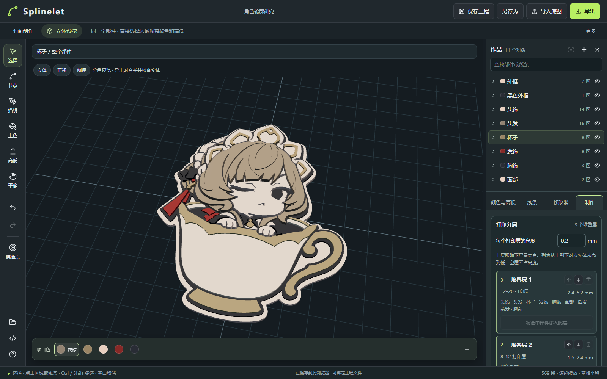
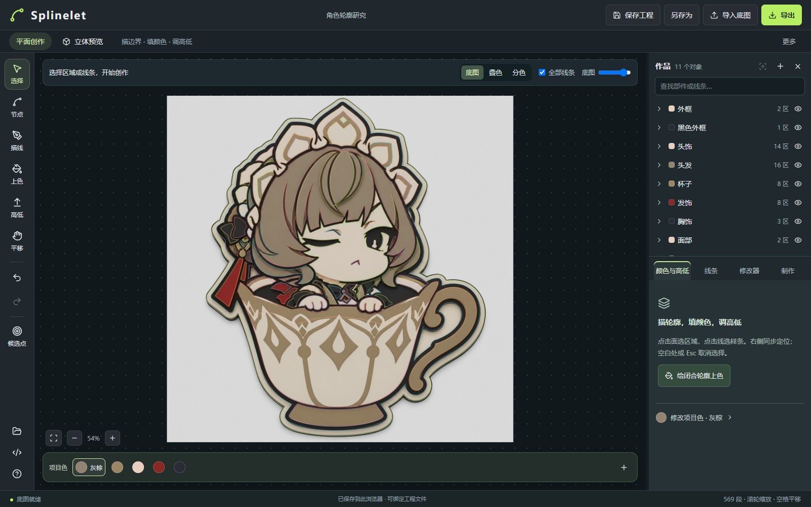
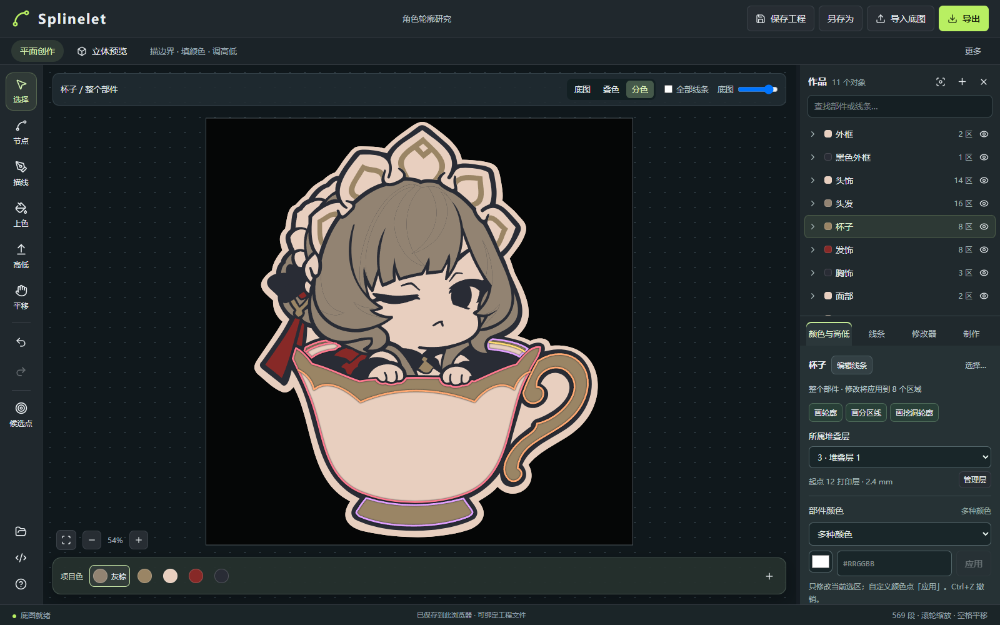

# Splinelet

**Trace images. Shape curves. Build layered reliefs.**

Splinelet 是一个在浏览器中运行的贝塞尔描线与浮雕建模工具：垫入参考图，沿轮廓落点，组织分区和颜色，再把图案做成有层次的可打印体块。适合制作徽章、挂件、装饰牌等简单的 2.5D 作品。

你决定节点和构造关系，算法辅助拟合曲线；它不是一键图片转 3D，也不承担切片和打印机控制。



_本文为桑多涅参考工程的实际界面截图。模型是手工描线、分区和分层后的结果，不是自动识别生成，也不是实物打印照片。_

## 能做什么

- **辅助描线**：跟随深色线条或颜色边缘拟合三次贝塞尔。相邻两个落点之间只生成一段曲线，不插入额外锚点；控制柄可手工调整。
- **编辑样条**：节点移动、删除、连续性设置，头尾续画、端点合并、批量选择与拖拽，配合撤销和重做。
- **组织区域**：按部件管理轮廓、分区线、挖洞线和参考线；局部区域分别设置颜色和厚度，项目色卡统一管理配色。
- **组合构造**：面修改器支持分区、布尔差／并／交和轮廓偏移。上游关系失效时暂停受影响的输出链，修复来源或明确重建后再继续。
- **分层浮雕**：用堆叠层安排上下关系，以打印层高的整数倍设置厚度，下层变厚后上层随之抬升。
- **保存与导出**：用独立 `.spl` 工程文件保存参考图与全部编辑数据，导出通用 3MF、SVG 或 Blender Python；也提供可选的 Bambu 工程导出和 Agent API。

## 本地运行

需要 **Node.js 22.13 或更高版本**和 **pnpm 11.26.0**，使用带鼠标的桌面浏览器。支持文件访问 API 的 Chrome / Edge 可以绑定本地工程文件。

在仓库目录执行：

```sh
pnpm install --frozen-lockfile
pnpm dev
```

打开终端显示的地址，默认是 **http://localhost:3000/**。无需配置打印机或 API Key。

```sh
pnpm build  # 构建
pnpm start  # 运行构建后的本地服务，地址以终端输出为准
```

### 桌面应用

桌面版使用 Tauri 2，开发环境还需要 Rust 工具链与当前平台的 Tauri 系统依赖。Windows 使用 WebView2。

```sh
pnpm desktop         # 启动 Tauri 开发应用
pnpm desktop:build   # 只构建桌面前端
pnpm desktop:release # 构建免安装桌面程序
```

Windows 发布产物为 `src-tauri/target/release/splinelet.exe`，前端资源已内嵌，直接运行即可，不需要附带 `src-tauri/target/frontend/`。目标电脑需要已安装 WebView2 Runtime；应用不再生成安装包，也不自动注册 `.spl` 文件关联。恢复草稿仍保存在用户数据目录，免安装不代表数据随 EXE 携带。

桌面版支持通过“打开工程”或命令行路径打开 `.spl`、单实例传递和原子保存。用户也可在 Windows 中手动设置打开方式，但移动 EXE 后需重新指定路径。应用使用与工作区一致的无终端自绘窗口框架；Web 版与桌面版共用同一套 React、Worker 和几何实现。

应用目前以中文界面为主。初次启动会载入内置的 Sandrone 完整工程；浏览器已有工程时优先恢复。

## 基本工作流

### 1. 从图片新建工程，建立部件

点击左上角 Splinelet 菜单中的「从图片新建工程…」，选择 PNG、JPG 或 WebP。这会替换当前工程，操作前先保存需要保留的内容；已有 `.spl` 工程可从同一菜单的「打开工程…」继续。旧 `.bezier.json` 工程仍可导入，下次保存时会创建 `.spl`。

在右侧作品树新建部件，双击名称改名。按可独立编辑的部分组织作品，例如外框、头发、杯子，而不是每条线都单独建一个部件。选择「底图」显示方式，便于对照参考图描线。

### 2. 沿轮廓落点，调整曲线

选择「画轮廓」或描线工具，依次点击关键位置。算法只计算两点之间的控制柄，节点的数量和位置由你控制。

- 按住 **Shift** 落点：临时取消吸附。
- 按住 **Alt** 落点：取消吸附与拟合，使用直连。
- 选择工具只选中和框选，不拖动形状。用节点工具调整锚点和控制柄，支持当前路径内多选节点一起移动；开放曲线可以从头或尾继续画。
- 用 **C** 闭合轮廓。遇到复杂分岔时主动增加落点，比强行一次拟合很长的曲线更可控。



### 3. 分区、挖洞，给局部上色

闭合轮廓确定基础范围。在部件内画分区线，将一个区域拆成多个区域；闭合的挖洞轮廓用于扣除面积。分区线应贯穿目标区域，不能只在面内悬空结束。

使用「上色」给区域填色，或在右侧“选区 → 属性”中修改颜色与厚度。选整个部件会作用于其多个区域，编辑前先看详情栏的选择范围。项目色卡位于“工程 → 色卡”；修改色卡会联动引用它的区域。

「底图」「叠色」「分色」只改变显示方式。单选一个部件或它的区域时，可在“选区 → 构造”组合分区、布尔或偏移步骤；这些操作不改写源贝塞尔节点。需要整理全工程的构面来源、体块或零件时，从“工程 → 设置 → 工程高级构造”打开编辑器。



如果移动轮廓使既有分区不再成立，查看构造链的错误并修复源线；确实要改变结构时，再明确重建输出或移除相应步骤。应用不会把失效区域悄悄替换成另一块面。

### 4. 安排堆叠层，再设置局部厚度

在“工程 → 分层”中设置打印层高并启用分层，新增堆叠层；选中部件后，在“选区 → 属性”中将它分配到相应层。

这里有两个不同的概念：

| 概念     | 用途                                                                         |
| -------- | ---------------------------------------------------------------------------- |
| 堆叠层   | 安排部件上下关系。上层起点跟随下层最高点；层数和名称由你决定。               |
| 打印层高 | 一次打印层的物理高度，例如 0.2 mm。区域厚度按整数打印层设置，8 层即 1.6 mm。 |

切换「立体预览」检查形状和层次。下层增厚会抬升其上方各层；修改打印层高会保持层数，改变物理厚度。不同区域仍可有各自的厚度。

有完整底层轮廓时无需另加底板。可在“选区 → 属性”使用“生成承托部件”；它是可选的引用外形与外扩操作，不是每个作品的必经步骤。

### 5. 检查、保存、导出

在“工程 → 设置”中设置底图对应宽度（工程物理比例），在“工程 → 导出”选择要输出的零件、执行“检查可打印实体”并导出。工程尺寸以毫米计算；源线导出的比例按整张底图宽度换算。

| 格式                 | 用途与边界                                                                                               |
| -------------------- | -------------------------------------------------------------------------------------------------------- |
| **通用 3MF**         | 默认打印导出。包含分色实体、毫米尺寸与相对位置，不绑定打印机。到切片软件再选择机器、耗材和工艺。         |
| **Bambu 工程 3MF**   | 可选折叠入口。从已有 Bambu 工程读取配置模板，携带部件耗材编号和切片参数；实际 AMS 槽位在切片软件中选择。 |
| **分色 SVG**         | 导出已填色区域与孔洞；派生边界按计算精度采样。                                                           |
| **源线 SVG**         | 从“工程 → 导出 → 源曲线 SVG”导出可编辑的原生三次贝塞尔路径。                                             |
| **Blender Python**   | 在 Blender 的 Scripting 工作区运行，创建最终实体及独立隐藏集合中的源贝塞尔。当前实体导出为单一材质。     |
| **Splinelet `.spl`** | 原生可编辑工程，保存底图、源线、构造关系、颜色和层设置。                                                 |

STL 保留在兼容 API 中。通用 3MF 不带切片软件的专有配置。Bambu 可能提示「仅加载几何」，部分软件需要重新指定颜色／耗材；这不等同于模型几何损坏。格式细节见 [3MF 导出说明](docs/3mf-export.md)。

高级构造编辑器还可导出“构造面数据 SVG”，仅包含其中所选或全部旧构造配方的派生面轮廓，不包含后续修改器和体块；它不是成品导出。主要的实体检查、3MF、Blender、分色 SVG 和精确源曲线 SVG 都在“工程 → 导出”完成。

源曲线导出窗口中的“挤出厚度”控制源曲线 Blender 脚本的挤出值；编辑作品区域的厚度请使用“高低”工具或区域属性。

**Ctrl+S** 首次选择文件后绑定保存，之后每次按下 Ctrl+S 或点击顶栏保存图标才写回同一文件；**Ctrl+Shift+S** 另存为。编辑后的恢复草稿会自动保存，供刷新或意外关闭后恢复，但草稿不是文件备份的替代品。不支持文件访问 API 的浏览器会下载 `.spl`。格式细节见 [Splinelet 工程格式](docs/project-format.md)。

## 常用操作

| 操作                          | 快捷方式                             |
| ----------------------------- | ------------------------------------ |
| 选择 / 节点 / 描线 / 移动对象 | V / A / P / H                        |
| 平移画布 / 缩放               | 右键、空格或中键拖动 / 滚轮          |
| 取消选择或当前操作            | Esc；空白单击取消选择                |
| 撤销 / 重做                   | Ctrl+Z / Ctrl+Shift+Z                |
| 作品树改名                    | 双击名称；箭头单独负责展开           |
| 三维视角                      | 左键拖动旋转，右键拖动平移，滚轮缩放 |

详细节点、路径、合并、续画和兼容 API 操作见 [源线编辑器手册](docs/source-editor.md)。属性栏竖排分为“工具 / 工程 / 选区”，当前按钮向右与内容区连成一个面板；没有选择时不显示“选区”。线条只提供属性；只有单选一个部件或其区域时才显示“构造”。需要两线围面、构面布尔、凹槽／贯穿或零件定义时，从“工程 → 设置 → 工程高级构造”打开高级构造编辑器。

## 当前边界

Splinelet 面向轮廓拉伸得到的 2.5D 浮雕，仍在迭代中。面修改器不等于通用三维网格建模；目前没有圆角、斜面、自动最小壁厚分析或切片功能。

分层安排竖直位置，不自动解决同层轮廓关系。下层高低不齐时，上层可能局部悬空。彩色预览用于编辑外观，最终导出另执行实体构造和检查；检查通过不等于已经验证特定机器上的打印效果。应在切片软件中确认连通、承托、薄壁与耗材分配。

参考角色图与截图用于演示工作流，图像权利归各自权利人；不作为应用原创素材或通用模型授权声明。

## 文档与开发

- [完整文档索引](docs/README.md)
- [统一创作与 API](docs/creation-2026-09-19.md)
- [源线编辑与快捷键](docs/source-editor.md)
- [编辑模型评审与重构计划](docs/architecture/editor-model-review-and-refactor-2026-09-19.md)（对象组织、求值管线与渐进交互；设计提案，尚未实施）
- [V4 重构任务总控](tasks/editor-model-v4-refactor/README.md)（模块分发、并行依赖、交付与验收）
- [面修改器](docs/modifiers.md) · [构造链与失效处理](docs/architecture/construction-pipeline.md)
- [打印分层](docs/print-stack.md) · [3MF 导出](docs/3mf-export.md)
- [Splinelet 工程格式](docs/project-format.md)
- [高级构面与实体操作](docs/modeling-2026-09-19.md)

主要使用 React、TypeScript、Vinext / Vite、Three.js、JSTS 和 Manifold。底图、曲线与几何计算在浏览器中处理，构面和实体运算放在 Worker 中。

### 仓库结构

根目录的主要目录是 `app/`、`src/`、`public/`、`src-tauri/`、`scripts/`、`docs/` 和 `tasks/`；`dist/` 是构建生成目录，不纳入版本控制。

```text
app/                 Web 路由入口与全局样式
src/
  components/        共享应用与工作区界面
  desktop/           桌面 HTML 与 React 启动入口
  hooks/             可复用 React 状态逻辑
  lib/               领域模型、几何、导出与平台适配
  types/             Vite 资源与 Worker 导入类型
public/              静态资源与兼容 URL 运行时
src-tauri/           Tauri 原生宿主；target/frontend/ 为桌面前端输出
scripts/             构建、测试与验证工具
docs/                当前指南、架构和历史 QA
tasks/               复杂工程任务、模块工作包与验收管理
dist/                Web 构建输出
```

Web 路由 `app/page.tsx` 和桌面入口 `src/desktop/main.tsx` 共用 `src/components/studio/studio-entry.tsx`，默认仍加载现有 `studio-app.tsx`。浏览器与 Tauri 能力位于 `src/lib/platform/`，`@/*` 映射到 `src/*`，原生宿主位于 `src-tauri/`。目录职责与迁移映射见 [工程结构](docs/architecture/project-structure-2026-09-19.md)。

部分核心回归检查：

```sh
pnpm typecheck
pnpm test
pnpm build
```

完整双端检查使用 `pnpm check:all`（需要 Rust 与 Tauri 系统依赖），涵盖类型、lint、单测、格式、原生编译检查及双端前端构建。仅构建两端前端使用 `pnpm build:all`；原生发布程序使用 `pnpm desktop:release`。

部分历史回归使用本地参考工程，详情见各脚本和专项文档；不要在日常工程标签页运行会替换工程的浏览器测试脚本。

### Agent 接口（可选）

浏览器提供 `window.traceStudio.call(action, args)`。先用 `state`、`creation_inspect` 读取当前状态，再执行命令；涉及区域修改时使用最新 `revision`。

Agent API 4.1 的 `spline_inspect` / `spline_apply` 可直接读写锚点与双控制柄，批量变换、复制或替换精确贝塞尔，一次提交对应一次撤销；详见[精确样条接口](docs/source-editor.md#精确样条-api-41)。重复纹样可通过“曲线镜像 → 曲线旋转阵列 → 闭合构面”构造，之后继续使用同一套颜色、厚度、分层和导出，见[修改器](docs/modifiers.md)。

平面和立体画布支持[派生样条预览](docs/modifiers.md#派生样条预览)：切换源线、镜像和阵列阶段，拖动源节点即时查看结果，构面失败时仍显示当前曲线与未接合端点。API 可通过 `creation_inspect.curvePreviews` 读取相同阶段与诊断。

节点工具支持[端点吸附与对称接缝](docs/source-editor.md#端点吸附与对称接缝)：拖近自由端点或镜像／阵列接缝即可精确对齐，已有对称接缝默认保持，沿辅助线调整形状；按 Alt 可暂时解除。

```js
await window.traceStudio.call('creation_inspect');
await window.traceStudio.call('creation_view', { view: '3d' });
await window.traceStudio.call('creation_export', { format: '3mf' });
```

如需本机 HTTP 桥接：

```sh
node scripts/agent-server.mjs
```

桥接监听 `127.0.0.1:4318`，浏览器连接限定为 `http://localhost:3000`。普通手工创作无需启动它；接口返回导出数据，不自动下载。

V4 数据模型重构仍在进行中，Web 与桌面端保持现有工作区的布局、样式、工具和基本行为。简化候选界面的 URL 入口已撤销；后续从原界面的数据与命令边界接入，进度与真实工程验收见 [V4 验收索引](tasks/editor-model-v4-refactor/acceptance-2026-09-19.md)。

V4 宿主中的原用途操作通过规范成员与构造命令处理边界、参考、分区和挖洞，暂停再恢复内轮廓时保留原孔洞关系。复杂派生来源通过对应构造编辑，内部连接不增加默认界面概念；默认入口切换仍以完整验收为前提。

V4 宿主中的原“底图对应宽度”使用同一源比例命令更新轮廓、空间关系和参考图，偏移、厚度和接合容差仍按毫米解释。源画布比例随工程保存与撤销；视图缩放和平移不写入这个坐标框。默认入口仍待其余工作区及完整验收完成后切换。
