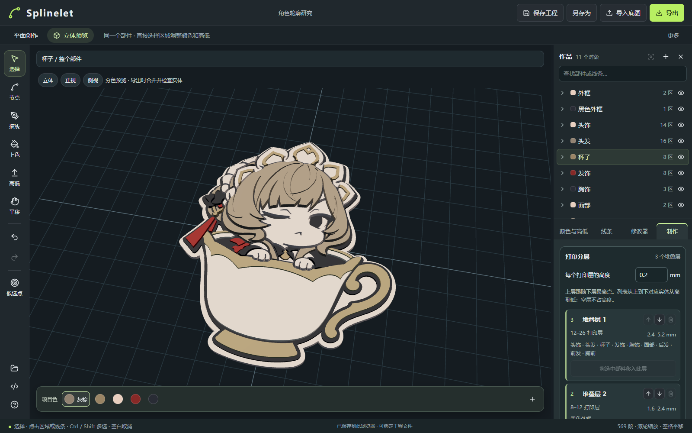

# Splinelet

**Trace images. Shape curves. Build layered reliefs.**

Splinelet 是一款用于贝塞尔描线与 2.5D 浮雕建模的工具，可在浏览器或 Tauri 桌面应用中使用。垫入参考图，沿轮廓落点，组织区域和颜色，再做成有层次的可打印模型，适合徽章、挂件和装饰牌等作品。

你决定节点和构造关系，算法辅助拟合曲线。它不是一键图片转 3D，也不承担切片和打印机控制。



_内置 Sandrone 示例的编辑界面。模型由手工描线、分区和分层制作。_

## 主要功能

- **参考图与描线**：叠放多张参考图，沿线条或颜色边缘拟合贝塞尔曲线，手动调整节点和控制柄。
- **SVG 导入**：保留可编辑曲线，将填充、孔洞和带宽度的描边用于浮雕。
- **区域与构造**：按部件组织轮廓，使用分区、挖洞、镜像、阵列、布尔和偏移构造形状。
- **颜色与厚度**：为区域设置配色和厚度，用堆叠层安排上下关系，在三维预览中检查作品。
- **保存与导出**：用 `.spl` 保存完整工程，导出通用 3MF、分色 SVG、源曲线 SVG 或 Blender Python；支持可选的 Bambu 工程 3MF。

## 本地运行

需要 **Node.js 22.13 或更高版本**和 **pnpm 11.26.0**。

```sh
pnpm install --frozen-lockfile
pnpm dev
```

打开终端显示的地址，默认是 **http://localhost:3000/**。无需配置打印机或 API Key。建议使用带鼠标的桌面浏览器；Chrome / Edge 的文件访问 API 可用于绑定本地工程文件。

```sh
pnpm build  # 构建 Web 版
pnpm start  # 运行构建后的本地服务
```

### 桌面应用

开发桌面版还需要 Rust 工具链和当前平台的 Tauri 系统依赖；Windows 需要 WebView2。

```sh
pnpm desktop         # 启动 Tauri 开发应用
pnpm desktop:build   # 构建桌面前端
pnpm desktop:release # 构建免安装桌面程序
```

Windows 程序输出到 `src-tauri/target/release/splinelet.exe`，已内嵌前端资源，不生成安装包或自动注册文件关联。恢复草稿保存在用户数据目录。桌面版支持打开 `.spl`、命令行路径打开、单实例传递与原子保存。

## 开始创作

应用以中文界面为主。初次启动载入内置 Sandrone 示例；已有恢复草稿时优先恢复。

1. 从左上角菜单选择「从图片新建工程…」，或打开已有 `.spl`。
2. 建立部件，沿轮廓描线，用分区和挖洞组织局部区域。
3. 给区域设置颜色与厚度，用堆叠层安排上下关系。
4. 查看立体预览，检查可打印实体，保存工程并导出 3MF。

**Ctrl+S** 保存，**Ctrl+Shift+S** 另存为。恢复草稿会自动保存，但不会代替手动写回工程文件；不支持文件访问 API 的浏览器会下载 `.spl`。

详细步骤、界面入口和快捷键见 [上手指南](docs/getting-started.md)。

## 适用范围

Splinelet 面向轮廓拉伸得到的 2.5D 浮雕，目前没有圆角、斜面、自动最小壁厚分析或切片功能。分层安排竖直位置，不自动解决同层轮廓关系；下层高低不齐时，上层可能局部悬空。导出后应在切片软件中确认连通、承托、薄壁与耗材分配。

参考角色图与截图用于演示工作流，图像权利归各自权利人，不作为通用模型授权声明。

## 文档与开发

- [文档索引](docs/README.md)：使用指南、格式说明与架构参考。
- [源线编辑](docs/source-editor.md) · [面修改器](docs/modifiers.md) · [打印分层](docs/print-stack.md)
- [工程格式](docs/project-format.md) · [3MF 导出](docs/3mf-export.md)
- [Agent API](docs/agent-api.md)：通过 `window.traceStudio.call` 读取和编辑工程。
- [工程结构](docs/architecture/project-structure.md) · [开发与验证命令](scripts/README.md)

项目使用 React、TypeScript、Vinext / Vite、Three.js、JSTS 和 Manifold。Web 与桌面版共用前端，图像与几何在本地处理，构面和实体运算在 Worker 中执行。

```sh
pnpm check:all
```

完整检查包括类型、lint、单元测试、格式、Rust 编译检查和双端前端构建，需要 Rust 与 Tauri 系统依赖。浏览器交互与原生应用验证见脚本手册。
