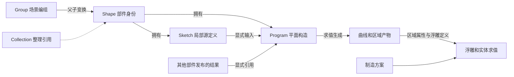
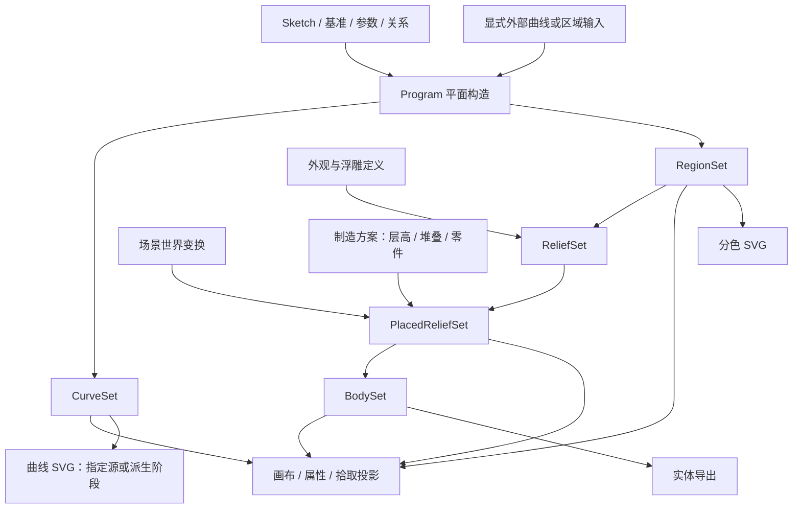

# 编辑模型评审与重构计划：对象组织、求值管线与渐进交互

日期：2026-09-19。代码基线：`180f569`（已包含对象移动工具与右键平移）。状态：**设计评审与执行计划，尚未实施 V4**。本文区分已复现的问题、代码中的结构性风险和建议目标，不将目标行为描述成当前产品能力。

本方案以三个问题组织设计：**用户怎样组织作品；原始定义怎样生成可编辑、可显示、可制造的结果；内部能力怎样增长而不增加简单任务的概念负担。** 事务、迁移和性能服务于这些边界。第 2 节保留既有代码审查与复现证据；本次迭代修订设计，没有实施 V4 或修改用户工程。

## 1. 结论与必须作出的决定

当前模型已支持“部件内描线 → 区域上色与厚度 → 分层与导出”的产品流程，应继续守护这个用户模型。内部的源路径、旧面配方、创作对象和实体特征存在重叠权威，尚缺稳定的场景身份和分层求值边界。评估重构是否成功，以对象关系是否单义、数据阶段是否可组合、简单任务是否仍然直接完成为准。

原方案的 Group/Shape 分责、局部坐标和定义/求值分离成立；需要修正默认四层技术目录、引用时必选坐标术语，以及只列操作顺序却未定义中间数据域的部分。目标是适合 2.5D 浮雕的编辑内核和渐进界面，不以通用 DCC 的概念数量衡量成熟度。

建议确立以下决定，后续任务不得各自重新解释：

1. **可整体操作的编组是一种场景对象 `GroupNode`，但不是建模部件。** 它有身份、父级、变换、显示与锁定状态；不拥有统一的源几何、填面程序或厚度。
2. **建模部件是 `ShapeNode`。** 它是用户命名、摆放和继续编辑的对象身份，可只有开放线条，也可产生多个区域、连通块和不同颜色/厚度。空白、未构面、构造失败均不改变其身份；一个区域或一个实体不自动成为新部件。
3. **整理集合 `Collection` 是引用关系，首版仅用于必要的旧信息保留。** 它没有坐标系，不隐式合并、移动或改变构造。普通整理统一使用“编组”；不同时向普通用户推出“组 / 集合 / 标签”三套组织入口。
4. **现有 `groups[]` 不能批量改名为 `GroupNode`。** 样例中它们已经参与推导创作部件。迁移以已有 `creation.objects` 的建模归属为准，每个现有对象先保留为一个 `ShapeNode`；保留剩余旧分组的整理信息。
5. **对象移动只修改对象变换。** 局部源节点、镜像轴、阵列中心、停用修改器参数均不随整体移动重写。
6. **源几何与构造意图持久化，求值产物和编辑会话各有独立边界。** 求值不得在普通读取过程中猜归属、创建对象或补写设计意图。
7. **构造使用有类型程序，数据按曲线、区域、浮雕定义结果、已放置浮雕和实体分层。** 平面构造 Program、场景树、区域属性和制造方案各有职责，共用依赖调度，不合成一个万能节点系统。GUI 中的构造步骤是程序投影。
8. **吸附、约束、连接、构面分开。** 屏幕吸附帮助定位；关系需要持久化；连接决定拓扑；构面消费合法闭环。
9. **默认只让用户理解部件、线条、区域、颜色与厚度。** 编组、分层、重复构造按任务出现；Source、Port、CurveSet、OutputRef 等内部概念不进入默认树和属性页。
10. **简单操作与高级构造使用同一份定义、同一条求值链。** 描线、分区、挖洞等语义命令负责建立明确的输入和步骤；高级详情展开这些记录，不另建“简易模式”数据或另一套隐式求值规则。

评审顺序：先读第 3 节的对象与用户模型，再读第 5 节的数据管线和第 6 节的交互投影；第 4 节是承载这些关系的 schema 骨架，第 8–10 节约束实施与验收。

## 2. 已核实的当前组织

| 当前数据/入口                          | 实际职责                                                            | 问题边界                                                          |
| -------------------------------------- | ------------------------------------------------------------------- | ----------------------------------------------------------------- |
| `Project.paths` / `TracePath`          | 全局底图像素坐标的 cubic、start、anchors、节点模式、显示信息        | 对象变换不存在；同一节点位置多处表达；节点和段主要靠数组索引寻址  |
| `Project.groups` + `path.groupId`      | 源路径分组与排序                                                    | 与 `creation.objects[].pathIds` 同时存在，不是同一个权威关系      |
| `model.regions`                        | path、between、stroke、split、布尔等来源 DAG                        | 引用全局路径，分区含历史空间 seed                                 |
| `model.features` / `model.parts`       | 旧拉伸、切除、贯穿、颜色高度及导出零件                              | 与创作对象、区域样式及打印方案共同参与最终结果                    |
| `creation.objects`                     | 路径归属、源 recipe、修改器、输出契约、局部样式、默认高度、打印归属 | 已是建模部件，界面和命令又把它当“集合”；没有 XY pose 或层级父对象 |
| `sources[featureId].modifiers`         | 旧特征的局部构造程序                                                | 与对象级栈、region DAG 并存，GUI 需要特殊来源栈入口               |
| `surfaceGraph` / `modifier.styles`     | 产物身份、拓扑契约与局部样式                                        | 保留来源是正确方向，但身份与样式位置分散                          |
| `creation.printStack`                  | 整数打印层、上下位置计算                                            | 已有独立制造阶段；物理高度仍被物化进多种历史记录                  |
| `scene.cells` / `curvePreviews` / mesh | 当前求值结果与诊断                                                  | 应继续作为运行时结果，不成为另一份可编辑源数据                    |

主要证据：[Project 类型](../../src/lib/project.ts)（`TracePath`、`CreationObject`、`Project`）、[创作规范化](../../src/lib/creation-schema.mjs)、[修改器阶段](../../src/lib/modifier-stages.mjs)、[打印分层](../../src/lib/print-stack.mjs)。

### 2.1 评审发现

P1 表示直接破坏编辑语义或阻碍对象模型成立；P2 表示必须纳入重构的结构风险。结构风险不等同于每个现有工程都已损坏。

| 编号 | 优先级/证据  | 发现与影响                                                                                                                                                                                 | 对应工作包 |
| ---- | ------------ | ------------------------------------------------------------------------------------------------------------------------------------------------------------------------------------------ | ---------- |
| F01  | P1，已复现   | H 的 `prepare_move` 最终只返回 pathIds；`translatePaths` 改曲线、旧 paint 与 seed，不改修改器中心。镜像/阵列构面对象整体移动后失效；没有源线的派生对象也被移动入口拒绝                     | R1、R2、R4 |
| F02  | P1，已复现   | 旧 `manage_group` / 顶层 `move_paths` 修改 `groupId`；创作命令 `move_paths` 修改建模归属。两套关系可以不一致，同名“移动”甚至表示不同操作                                                   | R2、R3、R5 |
| F03  | P1，代码确认 | `creationDocument` 在读取时生成对象、按来源频率推导 feature 所属、迁移修改器并规范化打印属性。归属由历史数据推导，不是明确保存的场景事实                                                   | R1、R2、R8 |
| F04  | P1，代码确认 | `combine_objects` 是合并建模所有权，遇到修改器、填色、叠放关系会拒绝；没有保留各部件构造的变换编组。日常整理被迫触碰构造语义                                                               | R5         |
| F05  | P1，代码确认 | 曲线与修改器没有统一局部空间；底图宽度参与几何换算。节点无稳定实体 ID，相邻 cubic 端点、start、anchors 有重复表示，插删节点后索引不是持久引用                                              | R1、R2、R4 |
| F06  | P1，代码确认 | `endpointSnapContext` 每次拖动推导接缝，`lockedId` 属于手势而非工程关系；`fill` 再用距离识别连接。没有可保存、可编辑、可诊断的端点绑定与接缝意图                                           | R6         |
| F07  | P1，架构风险 | 来源类型由 `usesCurvePipeline` 根据栈内容猜测；显式曲线程序要求对象全部输入都是 guide。来源角色、旧区域 DAG、分区特例、嵌套栈和对象栈共同决定几何，难以承载统一编辑与引用                  | R2、R8     |
| F08  | P2，代码确认 | 作品树只有扁平对象及路径/区域；F 定位使用源路径范围，无法正确覆盖远处阵列结果或纯派生部件；区域消失后选择会直接按当前 cell 列表清除                                                        | R4、R5     |
| F09  | P2，代码确认 | 样式/高度存在于 feature、对象、旧 paint、surfaceGraph、modifier.styles；`heightRecords` 必须遍历所有位置。增加新算子容易漏同步，单位和优先级不够集中                                       | R2、R7     |
| F10  | P2，代码确认 | 根组件事务、拖动、精确样条 API、创作命令各有写入入口；Worker 成功结果可经 `bindSurfaceGraphs` 用 `record=false` 补写工程。已有竞态防护应保留，但需要明确导入绑定、用户事务、纯求值三者边界 | R3、R8     |
| F11  | P2，代码确认 | `.spl` 容器与写入队列设计可保留，但当前文档强制单张参考图及像素尺寸；新文档应可无底图，资源映射与建模单位分离，不能靠往旧结构继续塞可选字段完成升级                                        | R2、R8     |

具体入口：

- F01：[对象移动入口](../../src/components/studio/studio-app.tsx) `startObjectDrag`、`pointerMove`；[prepare_move 与作品树](../../src/components/creation/creation-workspace.tsx)；[translatePaths](../../src/lib/source-editor/selection.mjs)。
- F02/F04：[源分组 API](../../src/components/studio/studio-app.tsx) `manageGroup` / `movePathBatch`；[创作命令](../../src/lib/creation-commands.mjs) `combine_objects` / `move_paths`；[所有权转移](../../src/lib/creation-path-transfer.mjs)。
- F05/F06：[节点索引与重建](../../src/lib/source-editor/node-edit.mjs)、[精确样条写入](../../src/lib/source-editor/spline-edit.mjs)、[吸附上下文](../../src/lib/source-editor/endpoint-snap.mjs)。
- F07/F09：[创作求值](../../src/lib/creation-engine.mjs)、[修改器求值](../../src/lib/modifier-engine.mjs)、[来源身份](../../src/lib/surface-lineage.mjs)、[打印高度记录](../../src/lib/print-stack.mjs)。
- F08/F10：[语义选择 hook](../../src/hooks/use-creation-selection.ts)、[工作区求值与 run](../../src/components/creation/creation-workspace.tsx)、[根编辑事务](../../src/components/studio/studio-app.tsx)。
- F11：[工程编解码](../../src/lib/project-format.mjs)、[保存队列](../../src/lib/persistence/workspace.mjs)。

### 2.2 应保留的设计

- `object/path/cell` 的语义选择已区分属性目标与源路径投影；V、A、H 的显式工具边界应保留。
- 修改器输入/输出类型、失败后停止相关构造、来源丢失不猜新目标，方向正确。
- `surfaceGraph` 的来源身份与样式绑定比坐标/面积猜匹配可靠；保留失效协议，升级身份粒度。
- 精确 cubic 编辑与整批事务、派生曲线预览、源数据与 mesh 分离值得保留。
- 打印层数作为制造权威值、隐藏与排除导出分离、导出走同一计算链，应成为新模型的验收条件。
- `.spl` 的资源清单、哈希、限额、确定性编码，文件串行写入、草稿/显式保存分离继续使用。
- JSTS、Manifold、底层贝塞尔算法可作为纯几何内核复用；重构重点是输入输出契约，不是重写全部算法。

### 2.3 既有基线验证快照

以下保留原始评审在本日期与基线上的验证记录；本次文档迭代没有重新执行其中的隔离浏览器验收，不代表 V4 已实现：

- `pnpm check:all` 通过，包括 25 组 Node 单测、类型、lint、格式、Rust 检查、Web/桌面前端构建。构建仍有 Manifold 的 `node:module` externalize 与大 chunk 提示；它们不是本次编辑模型问题的证据。
- 在 `127.0.0.1:4179` 新隔离 context 执行现有 `test-object-move-browser.cjs`，14 项检查通过；该 fixture 没有镜像/阵列构面，说明原移动回归缺少组合覆盖。
- 用 `liveSurfaces()` 加 `emblemSplines`，通过现有命令建立“镜像 → 四向阵列 → fill”，初始错误为空；对全部纹样源线执行 `translatePaths(..., 12, 7)` 后，两个 `centerMM` 仍为 `(0,0)`，构面在 `(12,43) mm` 报 degree=1。
- 对规范化后的 `liveSurfaces()` 新增分组并用 `movePaths` 移入 `outer/hole`，两条路径的 `groupId` 更新，`creationDocument` 中 owner 仍保持原归属。两套关系可被实际写成不同状态。
- 已提交的 `public/sandrone-example.spl`：76 条源路径、11 个旧分组、11 个创作对象、140 个 region、65 个 feature，求值 69 个 cell、0 个错误。对象中含嵌套来源栈、局部分区输出和打印归属，不能只用一个新曲线例子验证迁移。

## 3. 对象组织与默认用户模型

### 3.1 默认围绕作品组织，复杂度按任务展开

```text
作品
├─ 杯子                         用户将两个部件编组后才出现
│  ├─ 杯身                      部件
│  └─ 金色标记                  部件
│     ├─ 外轮廓                 展开部件后可见的线条
│     └─ 金色区域               可上色、调厚度的区域
└─ 其他部件

选区属性：颜色、厚度，以及与当前操作有关的控制
构造详情：用户使用镜像、重复、跨部件构造等能力时按需打开
工程设置：参考图、项目色卡、分层与导出
```

默认树只用用户名称及“部件 / 组 / 线 / 区”等必要提示。展开部件直接呈现需要编辑的线条和区域，不自动插入“源几何 / 基准与关系 / 构造 / 结果区域”四个技术目录。节点和控制柄随节点工具出现在画布；共享中心、关系和步骤只在对应构造详情中展开。大量派生区域按需列出、定位或筛选，不把全部中间产物堆进作品树。

普通闭合轮廓尚未上色时，树中保留线条条目，画布提供可点取的候选区域，不再并列一行“未参与成品区域”。首次上色后在部件下显示区域条目；源线仍可按线条显示选项或节点工具访问。该变化只过滤树的呈现，不创建第二份几何或改变部件身份；画布选择候选时明确显示“待上色区域”。

| 用户当前任务             | 默认呈现                                 | 按需展开的能力               | 不要求理解的内部概念             |
| ------------------------ | ---------------------------------------- | ---------------------------- | -------------------------------- |
| 画一个部件并上色、设厚度 | 部件、线条、区域、颜色、厚度             | 编辑节点、调整边界           | Sketch、Program、Source、Fill    |
| 在部件内分区或挖洞       | 分区线、挖洞线和结果预览                 | 有缺口时定位、预览补边       | 连接图、布尔端口、lineage        |
| 一起移动杯身和标记       | 多选、编组、组名                         | 展开组编辑部件               | parentId、局部矩阵、Collection   |
| 制作重复纹样             | 镜像、环形重复、中心、数量               | 连接边界、编辑母线、构造步骤 | Join、实例选择器、求值图         |
| 安排打印和多个零件       | 启用分层后显示层与层数；直接导出已有成品 | 在导出设置中管理多个零件     | ReliefSet、BodySet、材料体积映射 |

复杂度按当前任务和用户主动动作展开，不设置两套“新手 / 专家”工程模型。收起详情不改变构造；从高级编辑返回后，仍在原部件上选区域、上色和调厚度。错误先展示具体对象、原因和可做的修复，只在“详情”中展示技术依赖。

### 3.2 内部关系：场景层级、归属、依赖和产物各自明确

| 关系                           | 含义与权威                              | 是否决定场景层级                   |
| ------------------------------ | --------------------------------------- | ---------------------------------- |
| Group → Group / Shape          | `parentId` 决定摆放、整体选择和变换继承 | 是，唯一的场景父子关系             |
| Shape → Sketch / Program       | 建模定义的可写归属；跨部件读取用引用    | 否，不使 Sketch 或算子变成子对象   |
| Program → 输入与算子端口       | 数据流，决定如何生成结果                | 否，不通过树位置推断               |
| Shape → 求值曲线 / 区域 / 浮雕 | 生成关系；产物保留所属部件与来源        | 否，产物数量变化不创建或删除 Shape |
| Collection → 实体引用          | 整理或保留旧分类                        | 否，不拥有几何和变换               |
| 制造方案 / Part → 成员         | 生产放置及导出组合                      | 否，不重写场景或建模归属           |



Shape 的身份与几何表示独立。空部件、开放线部件、完成构面的部件、纯引用部件和暂时失败的部件使用同一种场景身份；没有区域时不能填色，但仍可命名、移动和编辑来源。一个部件可以输出多个区域或实体；区域可单独选择和赋属性，不因此成为场景节点。只有“提取为新部件”等明确建模操作才建立新 Shape。

参考图资源与其摆放分离，基准可归属于工程、组或部件；它们提供输入和辅助显示，不伪装成可填色部件。首版可写源几何归属唯一；无需为未来实例化再增加一套用户可见的“对象数据块”管理器。

### 3.3 各种“放到一起”的语义

| 操作                  | 存储结果                              | 是否改变构造/形状                            |
| --------------------- | ------------------------------------- | -------------------------------------------- |
| 编组对象              | 创建 GroupNode，重设选中节点 parentId | 保持世界位置，不合并几何                     |
| 解散组合              | 子节点换父级，保留世界变换，移除空组  | 不移除部件修改器、材质或制造归属             |
| 加入集合/标签         | 增加引用                              | 不改变变换与建模所有权                       |
| 重排作品树            | 调整兄弟顺序                          | 不改变 Z、不改变修改器顺序或打印层           |
| 转移源路径            | 明确改变 sketch 所有权或输入引用      | 属于建模操作，展示依赖影响并转换坐标         |
| 合并为一个部件        | 显式组合构造输入及样式映射            | 可能改变输出身份，不能由 Ctrl+G 或树拖动触发 |
| 布尔合并              | 添加 Union 算子引用多个部件结果       | 几何运算，来源部件保留                       |
| 分配到打印层/导出零件 | 修改制造方案映射                      | 不改变作品树父子关系                         |

GroupNode 不继承一套材质/厚度给所有子对象。组级“批量改色”是显式命令，先列出叶部件/区域范围，再一次事务应用。选择父组和其子对象一起移动时，只处理选中集合的最高根，避免重复变换。

GroupNode 的局部隐藏和锁定按父链组合为有效状态，显示继承来源；解组不覆盖孩子原有标志。制造是否启用独立于眼睛图标。集合只提供整理/筛选，不引入第二套含混的可见性继承。

### 3.4 现有编组如何处理

- 已有 `creation.objects`：保留对象 ID、建模归属、源输入、修改器、样式与制造关联，迁移为 ShapeNode。样例“杯子”的 8 条源线可能共同构造区域，不能分成 8 个独立 Shape。
- 只有旧 `groups/paths`、没有创作文档：在**导入时一次性**按旧规则建立 Shape，以保持原有构面行为；输出迁移映射，此后不再动态推导。
- 旧分组与现有对象一一对应时：用对象作为权威名称与归属，旧 group ID 进入兼容别名，不额外套同名空组。
- 分组跨对象、只有部分源线或名称冲突：保留为只引用实体的旧整理集合，标注迁移来源；不猜测新的变换父子关系，不把同一几何复制到多个 owner。
- 用户以后创建“杯身 + 标记”的编组，才建立新的 GroupNode。这是一项新的清晰操作，不能反向推断为旧文件已有意图。

## 4. 建议 V4 数据结构与唯一权威

以下是实施契约骨架，字段类型由任务计划 T00 冻结，再由 T02 实现；不是当前可读写格式。使用 ID 映射保存实体，数组只表示顺序或操作数集合，不能用数组位置当身份。

```ts
DocumentV4 = {
  version: 4,
  id: DocumentId,
  units: 'mm',
  nodes: Record<NodeId, GroupNode | ShapeNode>,
  sketches: Record<SketchId, Sketch>,
  datums: Record<DatumId, Datum>,
  parameters: Record<ParameterId, Parameter>,
  relations: Record<RelationId, Relation>,
  programs: Record<ProgramId, Program>,
  geometrySettings: GeometrySettings,
  appearances: AppearanceAssignments,
  reliefDefinitions: ReliefAssignments,
  manufacturing: ManufacturingPlan,
  assets: AssetManifest,
  references: ReferencePlacements,
  collections: Record<CollectionId, ReferenceCollection>,
};

SceneNode = {
  id,
  kind,
  name,
  parentId: GroupId | null,
  order: number,
  pose: { translationMM: [number, number], rotationRad: number },
  visible: boolean,
  locked: boolean,
};
GroupNode = SceneNode & { kind: 'group' };
ShapeNode = SceneNode & { kind: 'shape', programId: ProgramId };
Sketch = { id, ownerNodeId, vertices, edges, paths };
Program = {
  id, ownerNodeId, operators,
  outputs: { curves?: PortRef<'curves'>, regions?: PortRef<'regions'> },
};
```

这些顶层表是内部归一化存储，不对应同名面板。`appearances` 只记录颜色/材料引用；`reliefDefinitions` 记录区域是否参与成品、厚度、增减体模式与放置意图；`manufacturing` 记录层高、堆叠层和零件成员。对象默认与区域覆盖分别在对应赋值表内解析，源几何、算子和制造表不另存一份有效颜色或厚度。第 5 节的各类 Set 和编辑器投影均为运行时结果，不加入 DocumentV4。

### 4.1 归属、顺序和坐标

- `parentId` 是场景父子关系唯一权威；children 索引由其生成，不另外维护两份成员数组。父节点必须是 Group，禁止环。
- Sketch 和 Program 归属于一个 Shape；`Shape.programId` 与 `Program.ownerNodeId` 必须一一对应，由 validator 检查。Datum/Parameter 的 owner 明确为工程或指定 Node，以支持共享中心和参数；归属于组不赋予组建模输出。一个源几何只有一个可写 owner，其他部件使用显式引用，不通过扫描全局 paths 推断归属。
- 草图和对象内基准都在 owner 的局部毫米空间。世界变换由父链计算，不持久化 `worldMatrix` 的副本。
- 第一阶段 pose 只支持 XY 平移和旋转。缩放/镜像几何使用明确的 Transform 算子，放在构面/偏移之前或之后由用户决定；不引入未定义的非均匀缩放与毫米壁厚混合语义。3D 预览视角仍属于视图。
- 重新挂到父组时：`newLocal = inverse(newParentWorld) × oldWorld`。重设原点属于高级坐标重表达，转换本地位置、方向及输入映射，并更新依赖该局部框架的外部引用映射，使源对象和消费者均保持世界结果；普通移动只改 pose。临时操作枢轴属于会话，不要求用户为每个新部件配置原点。
- 参考图有像素到工程的标定变换。更换底图或标定不能隐式缩放模型；“按标定缩放几何”必须是另一项显式操作。

### 4.2 源节点、柄和关系

- `Vertex` 保存稳定 ID 及位置定义；相邻边引用节点 ID，避免 start/anchors/cubic 端点多份权威。封闭路径由有序边首尾连通表达，`closed` 可作为校验/派生值。
- `CubicEdge` 保存 start/end 顶点引用及两端柄向量；柄相对各自端点。`Path` 保存有向 edge use 列表，支持同一节点上的两条边保持尖角。
- `Path.handleModes` 可按稳定 Vertex ID 保存尖角、光滑或对称编辑规则。拖动任一侧时由同一命令调整配对柄；光滑保留另一侧长度，对称保持等长。它不增加坐标副本，也不把另一侧隐式变成单向 Relation 目标。求值直接使用已存柄向量，模式切换和拖动才改变源数据；明确的 Relation 驱动仍通过关系命令编辑。
- 源路径接合可以复用一个 Vertex；重合但未连接的点仍是不同实体。不能仅凭坐标相等决定焊接。
- 点位置可为自由值、沿基准轴的标量参数、引用点加偏移、受控表达式；方向和坐标框架也有对应类型。**自由参数持久化，求值坐标不再保存第二份。**
- 平滑/对称/自动柄以明确关系表达；连续性作用于指定的两个 edge ends，不假设多分支顶点只有统一的 left/right。
- 关系类型同时声明自由量、派生量及编辑写回规则：轴上点拖动修改轴上标量，对称柄编辑修改共享方向/长度；禁止把派生位置或柄向量再保存为另一份可写权威。普通节点编辑保留现有直接操控体验。
- 先支持有限、可解释的绑定与连续性关系，不在本次引入通用 CAD 非线性约束求解器。若以后支持联立约束，将其放进显式 SolveBlock；未知量、约束与求值结果有独立契约，不能与自由坐标同时作为权威。
- 引用依赖用 ID 校验，禁止表达式执行任意代码。引用缺失或环路成为结构化诊断；保留关系记录和用户修复入口，不按最近位置换目标。

### 4.3 三类编辑状态

| 持久工程                                                               | 运行时求值                                                     | 编辑器会话                                                           |
| ---------------------------------------------------------------------- | -------------------------------------------------------------- | -------------------------------------------------------------------- |
| 实体、局部参数、基准引用、关系、操作顺序、样式规则、制造方案、资源清单 | 派生曲线/连接图/面、世界矩阵、来源映射、包围盒、诊断、实体网格 | 工具、选区、活动编辑范围、树展开、视图、临时枢轴、吸附候选、拖动草案 |

工程保存不包含 Worker 缓存、浏览器文件句柄或最后成功网格。会话可以单独恢复，但不能影响同一工程的确定性求值。撤销初期继续保存不可变工程快照，先统一事务，不以压缩历史为前提。

## 5. 从原始定义到用户可见结果的管线

### 5.1 先定义数据域，再组合操作

内部阶段有明确输入输出；阶段不是用户必须逐个完成的页面。以下名称表示职责边界，允许惰性计算和缓存，不要求同时物化所有结果，也不要求五套独立对象类或编辑器。浮雕和放置结果可引用共享的不可变轮廓及变换，避免每经过一层就复制一份几何。

| 数据域            | 由什么产生                      | 表达什么                                                                                    | 主要消费者                                 |
| ----------------- | ------------------------------- | ------------------------------------------------------------------------------------------- | ------------------------------------------ |
| 源与构造定义      | 用户语义命令或导入              | Sketch、基准、自由参数、关系及 Program；持久化的创作意图                                    | 关系求值、平面构造                         |
| `CurveSet`        | 来源求值及曲线算子              | 局部毫米空间的精确曲线、端点连接及来源/副本映射                                             | 节点/曲线预览、Join、Fill、Stroke、Between |
| `RegionSet`       | 构面、分区、平面布尔等          | 具有身份的平面区域、外环/孔、来源；不承载另一份厚度权威                                     | 画布区域、属性目标、后续区域算子、浮雕解析 |
| `ReliefSet`       | RegionSet + 外观/浮雕赋值       | 区域对应的颜色/材料、成品参与状态、厚度表达式、增减体模式、Z 放置意图；仍可有层数与依附引用 | 放置与制造解析                             |
| `PlacedReliefSet` | ReliefSet + 世界变换 + 制造方案 | 已换算为世界毫米空间的轮廓、物理厚度/Z、增减体和 Part 归属                                  | 轻量立体预览、实体构造                     |
| `BodySet`         | 对已放置浮雕执行实体运算        | 按零件组织的最终实体及材料体积、诊断和来源映射                                              | 成品预览、制造检查、3MF/Blender 等实体输出 |



一个 RegionSet 可以包含多个区域；重叠、相邻、孔和独立连通块均需明确表达，不将“区域数组”默认视为已布尔合并的单面。同一 Shape 的多个来源子链可以汇入一个结果集，各成员保留身份；汇集不等于布尔合并。曲线、区域和实体的数量变化均不改变 Shape 数量。

各求值结果携带几何域、坐标框架、来源映射和状态；区分合法空结果、尚无该类输出、以及构造失败。开放线条部件没有 RegionSet 是正常状态；用户请求构面后未闭合才在该步骤诊断。运行时可将这些结果汇成 `ShapeResult`，供界面读取；它不是第二份可编辑部件。

`ReliefSet` 是 Splinelet 的 2.5D 语义边界：厚度与切削属于建模，颜色属于外观，层高与堆叠属于制造。制造解析先从权威厚度求毫米值，再按层/依附顺序解析 Z；浮雕层保存的是意图，PlacedReliefSet 才是本次解析的物理值。BodySet 按 Part 合并凸起并执行凹槽/贯穿，保留材料与区域来源。制造不会为了获得实体再生成一套可编辑的旧 regions/features。

### 5.2 Program 的边界与对外结果

首版 Program 负责局部曲线与平面区域构造。来源、曲线变换、Join、Fill/Stroke/Between、Partition、Boolean、Offset 和面阵列进入同一算子注册表；旧 recipe DAG、source 栈和 object 栈降为该图的显式子链。关系求值、区域赋值、浮雕解析、场景变换和制造是独立服务，可共用依赖调度器，不要求成为可任意排序的一条修改器栈。

每个算子声明具名输入/输出、几何域、参数、框架和来源规则。Program 明确发布 `curves` 和/或 `regions` 端口；无源线的部件可从引用端口开始。内部中间端口可用于明确的高级引用，但普通“引用轮廓 / 引用形状”命令直接选择对应已发布结果，不让用户找端口。

UI 构造列表是同一程序的任务投影：通常展示“镜像、环形重复、分区、挖洞、外扩”等步骤；基础 Source/Fill 和分支仅在相关详情中出现。旁路采用已声明的输入输出契约，域不兼容时阻断，不靠剩余栈内容重新猜部件来源。用户改数量或关闭镜像不会重新创建部件或把程序切换到历史特例。

### 5.3 简单操作自动编制同一条真实构造链

显式数据不等于要求用户显式装配数据。语义命令是唯一的编制入口：用户动作确定用途和范围，命令建立/更新 Source 输入集合与算子边；求值器只执行记录。`boundary/hole/divider/guide` 是创建工具的用途，不是求值时扫描所有线条后重新推导程序的开关。

| 用户动作             | 命令写入的定义                                                                     | 用户直接获得的结果                                            |
| -------------------- | ---------------------------------------------------------------------------------- | ------------------------------------------------------------- |
| 新建部件并开始画轮廓 | 创建 Shape、Sketch、Program，完成的路径加入明确的轮廓输入集合                      | 开放时显示线条，闭合提交时建立或接入基础 Fill，出现可上色区域 |
| 上色、调厚度         | 上色写外观赋值；首次上色同时启用该区域的浮雕贡献并采用部件默认厚度；厚度写浮雕赋值 | 沿用“画边界 → 上色 → 调厚度”的流程，不要求创建体块            |
| 画分区线 / 挖洞线    | 在当前目标上建立 Split / Difference 等明确步骤和输入；缺口补边需可见预览           | 新区域或孔直接反映在原部件上，继承规则不依赖 UI 模式          |
| 画辅助线             | 只增加源几何，未接入既有构造                                                       | 可继续编辑，不改变已有区域或成品                              |
| 镜像 / 环形重复      | 由操作面板编制参数、基准与曲线步骤；选择“连接边界”时建立明确接缝和构面链           | 可见重复结果及中心/数量控制，按需展开具体步骤                 |

普通新工程默认使用毫米厚度；用户启用打印分层后才显示层数及所属层。闭合轮廓的未启用候选面不因部件有默认颜色就全部变为实体；源线显示色也不是成品色。已启用区域的厚度编辑不改变上色范围。

基础链由创建命令一次建立，后续编辑通过稳定输入引用更新；新增轮廓是否接入，由当前绘制用途与目标决定。高级编辑改变连接后，快捷动作仍操作同一份程序；无法确定插入位置或作用范围时才让用户选目标步骤，不重建并覆盖既有程序。部分轮廓失效可以保留待修复定义，不能另走简易求值器补出面。

### 5.4 跨对象依赖采用任务语义

支持并区分两种读取方式：

- `local-result`：引用对方的局部构造结果，再用一个显式的输入变换放入本地，适合重复利用形状；对方场景位置变化不改变该输入放置。
- `world-result`：引用对方在场景中的实际结果，转换为接收对象局部空间，适合实际接触关系的布尔、切割、定位。

`world-result` 换算为 `inverse(receiverWorld) × sourceWorld × sourceLocalResult`。因此有外部世界引用时，单独移动对象可能改变构造，这是明确的引用语义。创建命令按意图选定空间：“引用形状”用 local-result，“按摆放位置切割”用 world-result。面板用“来源移动是否影响此处”说明行为；需要更改时再展开来源设置，普通操作没有 local/world 必答题。旧世界坐标布尔按 world-result 迁移。

局部参数引用、场景父链、算子数据流、跨对象引用和制造放置进入同一依赖调度，但分别保留组件/端口和边类别。循环判断在实际求值单元上进行，不把整个对象压成单个节点；一个独立基准驱动另一部件再被本部件使用，并不必然构成环。对象不得读取自己的下游结果定义上游锚点；共同中心和重复数来自上游共享参数。

### 5.5 连接与填面

镜像/阵列产生带实例来源的 CurveSet；接缝关系以源端点 ID、修改器 ID、实例选择器（如相邻副本并环回）寻址。Join 输出带共享顶点拓扑的 CurveSet；Fill 消费其合法边界和填充规则，产出 RegionSet，报告未闭合/分叉/交叉，不主动补线。普通闭合路径已有连通拓扑，无须额外放入无作用的 Join，也无须用户添加连接步骤。

“绑定在轴上”是几何关系；“两个端点合并为一个顶点”是连接规则；二者可以配合，不能互相替代。连接只合并位置，不自动平滑柄。用户的 1/8 母线保持开放，完整环在镜像、阵列和连接之后出现。

“保持接缝”由重复构造的可见选项建立永久关系；普通屏幕吸附不会自动生成永久约束。简单任务看到“闭合轮廓 / 分区 / 补边”，重复构造看到“连接边界 / 保持接缝”，内部 Join/Fill 的职责不因显示名称而合并。

屏幕吸附距离、求解数值精度、几何内核容差分别配置和命名；不把 10 px 换算后直接当作制造焊接阈值。扩大容差不作为既有接缝约束的替代方案。

### 5.6 产物身份、属性与失败

- OutputRef 包含 owner、operator、port、来源 lineage/实例信息；不能把 `scene.cells[3]` 当稳定对象。
- 输出区域的颜色与浮雕属性分别保存为以 OutputRef 为目标的赋值；对象默认值只是一条明确的 fallback。同一目标同一字段只有一份最终赋值，不跨多处寻找最后生效的值。界面可以把它们放在同一个“颜色 / 厚度”面板。
- 拓扑保持时沿来源继承；一分多允许按明确规则复制样式；多合一且样式冲突时必须处理冲突。不可唯一匹配就保留 unresolved 引用，禁止按位置、面积、数组次序静默重挂。
- 不承诺任意布尔操作都有永恒面 ID。保留当前保守失效策略，给出丢失引用和受影响下游。
- 失败阶段仍展示本次有效的上游曲线、基准和诊断；下游结果可标为 blocked，不能用旧面冒充当前结果。删除的源 ID 与暂时无法求值的输出引用要区分，后者选区应可停留在错误行上修复。
- 首次绑定或重建输出契约由对应创建/编辑事务提交，求值仅返回候选，不在后台修改工程。颜色、厚度、后续切割目标均引用同一套输出身份，不能各自建立一套区域编号。

### 5.7 扩展边界与验证方法

| 后续扩展例子      | 应接入的边界                                       | 不应连带改变的模型                          |
| ----------------- | -------------------------------------------------- | ------------------------------------------- |
| SVG、文字等新来源 | 来源适配为 CurveSet 或 RegionSet；保留必要的源定义 | Group/Shape 身份、区域属性、制造与默认选择  |
| 新曲线或区域算子  | 声明已有数据域的端口、参数、来源规则及任务控件     | 核心求值器不增加按来源历史分派的特殊路径    |
| 新实体处理        | BodySet 的受控后处理及对应制造设置                 | 不把三角网格写回 Sketch，不改平面构造所有权 |
| 新显示或导出方式  | 消费指定 revision、阶段和坐标框架的结果            | 不重复解释旧 feature、线条用途或构造历史    |

这是扩展性检验，不代表首版加入文字工具、通用网格编辑或插件系统。新能力应有明确的数据域入口；只有真实需求无法由现有域表达时才增加新域，并同时定义转换和用户任务。内部阶段增多不自动增加默认 UI 分类。

## 6. 从求值结果到简单交互

求值缓存按文档 revision、节点/算子版本及依赖键组织。没有世界输入的部件移动时复用局部几何；有 world-result 输入时检查接收方自身及下游的失效。源节点改变仅使相关下游失效。缓存命中不能绕过单位、引用或输出契约校验。交互延迟在 R0 记录基线，在 R4/R6 以相同 fixture 比较。

### 6.1 界面是定义与结果的任务投影

作品树从持久 Node 取得身份和层级，从当前求值结果取得区域和诊断。一个部件构面失败时仍保留树行、名称和编辑入口。默认展开规则遵循第 3.1 节，只有主动查看构造时才呈现相关步骤、来源和基准，不以全量 schema 分支生成属性表单。

| 用户所见/操作           | 读取什么                                        | 编辑时写什么                                  |
| ----------------------- | ----------------------------------------------- | --------------------------------------------- |
| 部件/组树行与整体移动   | Node 定义、有效显示状态、求值范围               | Node 名称、pose、parentId；不移动源点         |
| 源线节点与柄            | Sketch 定义及关系求值坐标                       | 对应自由参数或明确的关系操作                  |
| 镜像/重复线与“编辑母线” | CurveSet 及来源/副本映射                        | 能唯一回写时编辑源定义，提示影响全部副本      |
| 可上色区域              | 区域投影：RegionSet + 对应已解析的外观/浮雕赋值 | 指向该区域的外观/浮雕赋值，不改运行时 polygon |
| 颜色与厚度控件          | 对应赋值的有效值、默认来源和选择范围            | 一次语义命令修改外观或浮雕定义                |
| 立体预览与成品检查      | PlacedReliefSet 或 BodySet                      | 通过区域来源发命令，不编辑显示网格            |
| 构造详情与修复          | Program 步骤、相关基准、阶段结果和诊断          | 同一 Program/Relation 定义                    |

保留“工具 / 工程 / 选区”属性导航。工具显示操作选项；工程管理共享资源、分层与导出；选区优先显示当前任务可用的颜色、厚度和范围。没有选区不显示选区页，线条不显示整个部件的构造；高级字段随明确入口展开。组只提供组操作和写明范围的批量属性，不借某个孩子的修改器冒充组的修改器。

树拖放区分“改父级”“同级排序”“转移源几何”，使用不同预览和提示。跨所有权的构造转移不能被普通整理触发。F 定位当前语义目标的求值包围盒；失败时使用它的可见上游范围，不只聚焦母线。

典型主路径：新建“杯身” → P 画闭合轮廓 → 上色 → 调厚度 → 查看立体 → 导出。整个过程不打开构造详情。需要多色时在同一部件内分区；需要纹样时增加一个部件并按需使用镜像/重复；需要整体移动时才编组。任何内部阶段的增加都不得让这条简单主路径增加技术配置步骤。

### 6.2 统一选择

Selection 保存 `{scope, entityRefs, activeRef}`，scope 区分场景与对象组件编辑。EntityRef 使用稳定 ID 和具体类型，派生元素附 stage/instance；源路径投影只用于高亮和关联显示，不作为真正的对象移动目标。

当前节点工具先维持一条活动线的节点编辑范围，不因 Sketch 可容纳多条线就扩大选择；框选与 Ctrl+A 服从当前 scope。保留 V 选择、A 编辑节点、P 描线、H 整体移动的工具边界；无需另学一组 DCC 的对象/网格模式。进入编辑母线、构造详情有明确动作和返回入口，不因为属性面板或派生面重算而自行跳层。

### 6.3 每次编辑只有一套执行入口

```text
GUI / Agent
  → 语义命令 + expectedRevision
  → 验证身份、范围和依赖
  → 建立编辑草案 / 更新自由参数
  → 关系求值与构造预览
  → 提交一条工程事务
  → 派生结果更新、撤销记录、草稿保存
```

推荐命令族：

- `scene.transform`、`scene.group`、`scene.ungroup`、`scene.reparent(keepWorld)`、`scene.reorder`。
- `geometry.editVertices`、`geometry.editHandles`、`geometry.splitEdge`、`geometry.transfer`。
- `datum.create/update`、`relation.bind/unbind`、`program.add/update/reorder`。
- `appearance.assign`、`relief.assign`、`manufacturing.assignLayer/assignPart`。

GUI 优先发出“画轮廓、分区、挖洞、上色、重复”等任务命令；这些命令在同一事务中组合上述内部操作。Agent 可以使用同样的任务命令，也可通过高级接口编辑构造定义。简单入口不会因内部需要多步而产生多次撤销。

这些是目标接口名称，不是本次新增 API。移动对象传 NodeRef，编辑几何传元素 ID，控制柄传 EdgeEndRef；API 参数必须声明空间，局部空间默认，world 输入经统一变换转换。所有写命令校验基准 revision，禁止把陈旧 nodeIndex 写到另一节点。

文档 V4 与 Agent API 版本分别管理，目标 Agent API 升为 5.0 并提供能力发现。4.1 的读格式可通过投影适配；依赖旧 group 归属、数组索引或原始 get_project 结构的写接口不能承诺无条件兼容。保留的旧写入口必须要求快照 revision，并把当时的索引解析成稳定 ID；不提供 revision 的调用返回迁移说明，不能默认拿当前 revision 冒充原快照。同步更新 HTTP 桥、WebMCP、示例和测试调用者。

手势从固定基线生成临时草案；拖动中不写文件、不累加历史。释放提交一次；Esc、失焦、取消捕获丢弃全部草案。无效的构面可以作为可编辑工程状态保存；非有限数、非法类型等结构错误拒绝提交。永久解除关系必须是显式命令；Alt 只关闭临时吸附，不能默默删除已保存约束。

### 6.4 在派生结果上编辑

预览元素携带 source ID、经过的算子/实例、局部到显示变换及编辑能力。镜像/旋转副本可通过逆变换回写母线，显示“影响全部副本”；一对多或不可逆布尔交点只定位来源/算子，不猜测回写对象。“应用修改器/转为独立几何”才创建新的源数据。

### 6.5 复制、删除和转移

普通复制复制构造定义并生成新的实体 ID，内部引用通过同一 idMap 重挂，外部引用默认保留并展示。复制组合时，组内对象之间的引用应指向复制后的组内成员，不能仍切割原对象。链接实例作为以后明确的操作，不让普通复制共享可写源几何。

删除使用反向依赖索引显示影响范围，区分“解散组合保留内容”和“删除组合及内容”。删除算子/基准导致的下游引用保留为可修复的失效记录，级联删除是另一项显式选择。不得为了通过 validator 自动清空引用、转移归属或改选相邻节点。

源几何转移先计算顶点/边/关系的闭包与引用影响，再转换到新 owner 的局部空间。跨 owner 不能共享同一可写 Vertex；需要保留关联时建立显式引用关系。若转移会改变一组构造输入，预览并提供“连同构造迁移”或“保留外部输入引用”的明确策略，不能由树拖动自行猜测。

## 7. 区域属性、浮雕与制造边界

- 项目色卡作为共享资源；赋色引用 swatchId。对象默认与局部输出覆盖有明确优先级，颜色不再分别写进 feature、paint 和 modifier。
- `reliefDefinitions` 按部件默认与区域覆盖记录成品参与状态、厚度、`add/cut/through` 及放置意图。同一部件的多个区域可以有不同厚度和底面；普通用户仍通过区域属性操作，无需手工创建每个浮雕记录。
- 厚度使用带单位的联合类型：`{kind:mm, value}` 或 `{kind:layers, count}`；只有一种权威值，另一种由制造解析换算。打印层高是这一步的输入，不在源数据上同步多份毫米数值。
- Z 放置使用显式模式：自由高度/高度依附，或打印层归属，每条浮雕记录只有一个有效模式。部件默认向区域提供 fallback，局部覆盖可以保留旧 `zOffsetMM` 语义。默认按部件分层；局部放置仅在需要时展开，不同时保留互相覆盖的 attachId、zMM 与 printLayerId。
- Group 没有自己的打印层。将组分配到某层是对其叶 Shape 的明确批量操作，解组不改变制造设置。
- 导出 Part 是制造方案中的成员集合，可含多个部件/材料体积；不是作品树 Group，也不是某个 region 的别名。简单工程具有默认成品归属，无需先建“零件”才能导出；只有管理多个零件时才展开设置。
- 平面、立体和导出消费同一文档 revision 下的指定阶段结果，不强制消费同一种几何。源曲线 SVG 指定源阶段曲线及世界变换，保留精确 cubic，不读取经过镜像/阵列的最终曲线端口；分色 SVG 读取赋色后的区域；Blender 源线部分与实体部分分别读取对应阶段；3MF 读取 BodySet 和材料映射。坐标/单位转换走共同适配，导出器不重新解释构造。
- PlacedReliefSet 可提供低延迟挤出预览；影响可见形状的切削/贯穿和实体后处理必须呈现 BodySet 结果，计算未完成时明确标示状态。近似预览不能冒充已完成实体。显示和导出可以使用不同网格精度，但共享建模和放置语义。

## 8. 迁移与持久化

### 8.1 一次导入，一份新权威

保留 `.spl` ZIP、资源清单和安全限额设计，新增文档版本 4 的 reader/writer。容器布局不变时维持 containerVersion=1；文档字段与资源引用由 documentVersion 分派。扩展多资源读取时显式校验路径、数量、总尺寸和哈希，不能直接放宽所有限额。

V1/V2/V3 只在 import adapter 中读取。迁移结果为 `{documentV4, idMap, report}`；V4 editor、命令和求值不能同时维护回写的旧 `paths/model/creation`。兼容 API 是命令适配层，不是另一份工程。

迁移首次保存使用新的 V4 `.spl`，保留旧源文件；正常打开/预览不触发升级覆盖。恢复草稿记录文档版本，不再把 V4 写到会被旧客户端当 V3 使用的兼容 key。失败恢复保留原文件和报告，不产生部分升级文件。

### 8.2 字段迁移规则

| 旧内容                                                | V4 目标                                     | 关键规则                                                                                       |
| ----------------------------------------------------- | ------------------------------------------- | ---------------------------------------------------------------------------------------------- |
| width/height/widthMM/image                            | 参考资源 + pixelToWorld 标定                | 固定旧比例，几何换成毫米；工程可无图片                                                         |
| creation.objects                                      | ShapeNode + Program                         | 保留原对象 ID；初始 pose 为 identity，不按新包围盒自动选原点                                   |
| groups/groupId                                        | Shape 的兼容别名或整理 Collection           | 按第 3.4 节，不静默拆分几何或制造关系                                                          |
| path.curves/start/anchors/nodeModes                   | Sketch graph                                | 以实际 cubic 为主，生成并持久化稳定 vertex/edge ID；相邻同一逻辑节点校验一致；跨路径不自动焊接 |
| model.regions                                         | 具名算子与端口                              | 保留来源 DAG；共享 recipe 可显式引用，禁止按所在数组重新猜 owner                               |
| model.features                                        | 区域输出引用 + reliefDefinitions / 制造映射 | 保留逐 feature 的 add/cut/through、enabled、part 与高度依附；不在平面 Program 中混入旧体块权威 |
| sources 与 object.modifiers                           | 同一 Program 中的显式子链                   | 保留顺序、输入域、停用步骤和外部引用                                                           |
| centerMM/angleDeg                                     | 本地基准与参数引用                          | 初始局部框架与旧模型空间重合，因此初始外观不变；数值相等不自动认定为共享锚点                   |
| paints/surfaceGraph/styles/featureSwatches            | OutputRef + 外观/浮雕赋值                   | 对成功绑定的身份保留映射；旧空间匹配只用于导入；歧义进入报告                                   |
| modifier.targets.refs / outputContract                | 同一套 OutputRef 与输出契约                 | 映射已选作用范围，失效引用不得降级为作用全部区域                                               |
| heightMM/heightLayers/zOffsetMM/attachId/printLayerId | 类型明确的厚度和制造放置                    | 按旧有效模式保留逐输出底面；整数层数不重舍入；显示隐藏与打印排除分别保留                       |

若旧 cubic 相邻端点本来存在缝隙，不可因建新 graph 就拉到一起。保留为独立端点/路径段并记录诊断。只有同一逻辑节点且坐标一致的冗余记录折叠为单节点；容差修复另有明确操作。

旧 region 若跨多个 owner 引用路径，迁移为明确的外部输入边；保留引用与第一次输出，不复制一份脱离来源的轮廓。对旧程序真正含混的来源/归属，报告并保留原始数据供恢复，不能用一次频率投票永久定新语义。

### 8.3 比较方法

迁移前后比较世界坐标 cubic、轮廓差集面积、边界距离、环/孔数量、连通块、局部颜色厚度、Z 范围、打印层数和实体有效性。几何按核的既有精度确定每类阈值，先记录再验证；不以截图近似或放宽容差掩盖差异。

对原本失败的工程，比较保留的源数据、引用和诊断状态，不要求迁移“自动修好”。对原本成功的工程，迁移不得新增失效或丢失样式；歧义迁移不能成为默认写入路径。

## 9. 执行计划入口

执行与验收统一在 [V4 重构任务总控](../../tasks/editor-model-v4-refactor/README.md) 管理。本方案保留架构决策和第 10 节验收标准；任务目录维护具体范围、依赖、负责人、证据和进度，不在两处重复排期。

任务按 **8 个模块工作包** 分发，每包包含项目背景、上下游合同、现有代码入口、可写范围及逐项检查点。23 个 T 检查点用于增量交付和验收，不要求分别新建 23 个执行任务；[四并发优先调度](../../tasks/editor-model-v4-refactor/README.md#四个并发名额下的优先分发)按依赖就绪启动。

为保留前文发现的追踪关系，原 R 编号与新检查点对应如下。R 编号只表示设计覆盖范围，不再承担执行顺序：

| 原范围            | 新计划检查点                                       |
| ----------------- | -------------------------------------------------- |
| R0 基线与契约     | T00 合同、T01 验证入口，P00 持续整合               |
| R1 场景与几何核心 | T02 文档、T03 场景、T04 Sketch、T05 关系           |
| R2 统一求值与迁移 | T06–T10 阶段求值、T18 单向导入                     |
| R3 事务与 API     | T12–T14 事务/命令/Worker、T19 文件会话、T20 API    |
| R4 默认编辑与投影 | T13 任务编制、T15 投影、T16 画布                   |
| R5 编组与作品树   | T03 场景、T15 投影、T17 树/属性                    |
| R6 基准关系与连接 | T05 关系、T07 曲线连接、T08 构面、T13/T17 任务入口 |
| R7 浮雕制造与导出 | T09–T11 浮雕/放置/实体、T17 属性                   |
| R8 默认启用与退役 | T21 完整验收、T22 默认切换和退役                   |

模块落点、复用/退役映射、G0–G5 门槛和证据要求详见任务总控；实际记录在[验收索引](../../tasks/editor-model-v4-refactor/acceptance-2026-09-19.md)。2026-09-19 用户校正：保留原工作区的布局、样式、工具和基本行为，在其数据与命令边界接入 V4，不能以独立简化编辑器替代原前端。主要实际工程验收为内置 Sandrone，补充 gold emblem；原生验收允许在本机运行。任一会话只有一种可写模型，旧形状的 UI 投影只读，不做双向 Project 转换。详细执行边界以[总控的用户校正](../../tasks/editor-model-v4-refactor/README.md#用户校正后的执行边界--2026-09-19)为准。

## 10. 最终验收矩阵

### 10.1 默认体验是发布门槛

U 项与几何正确性同等必要；应在隔离工程中按实际用户入口走完，并记录是否额外打开技术详情。以下不要求用户知道内部类名。

| 编号 | 用户任务                                       | 通过标准                                                                                                              |
| ---- | ---------------------------------------------- | --------------------------------------------------------------------------------------------------------------------- |
| U01  | 新建杯身，画闭合轮廓，上色，设厚度，预览和导出 | 全程无需构造详情或手工建 Source/Fill/体块/零件；未上色候选不重复列树；未启用分层时无层数设置；展开/收起详情不改变结果 |
| U02  | 在同一部件内分区、挖洞和局部改色/厚度          | 只理解线条用途、区域与作用范围；新分区按规则继承；缺口可直接定位/预览补边；无需手动加 Join 或选端口                   |
| U03  | 杯身与标记编组、移动、解组                     | 默认只有组和部件层级及按需线/区；世界外观和制造不变；不出现 Collection、模型所有权或坐标框架必答设置                  |
| U04  | 从开放母线制作重复纹样，再回到普通上色         | 构造面板只按任务展示中心、数量、连接边界等；“编辑母线”说明影响全部副本；返回后沿用区域属性，无技术目录常驻            |
| U05  | 用星形按位置切孔，或引用星形生成另一图案       | 两个入口按意图选定引用空间；说明来源移动的影响；不要求普通用户选择 local-result/world-result                          |
| U06  | 构面失败后修复，再保存重开                     | 原部件和有效线条可见，先给具体原因与修复入口；不跳到其他对象，不自动展开整个依赖图；保存重开和详情折叠不改变语义      |

### 10.2 对象、管线与工程不变量

| 编号 | 必须验证的场景                                   | 通过标准                                                                                                                       |
| ---- | ------------------------------------------------ | ------------------------------------------------------------------------------------------------------------------------------ |
| A01  | 无外部输入部件平移/旋转                          | 只变 pose；局部 Sketch、Datum、Program 字节级不变；最终结果刚性变换                                                            |
| A02  | 镜像→阵列→Join→Fill 后整体移动                   | 连接/孔/尖角不变；随后调节点与柄仍可编辑                                                                                       |
| A03  | 停用修改器、移动、重新启用                       | 结果按新对象位置求值，无留在原处的中心                                                                                         |
| A04  | 嵌套编组、解组、换父级                           | keepWorld；样式、打印层、源所有权不变；祖先/子节点多选只移动一次                                                               |
| A05  | 外部引用的两种空间                               | local-result 与 world-result 各符合契约；对象/父组移动与循环诊断正确                                                           |
| A06  | 插入/删除节点、拆分边                            | 未受影响实体 ID 不变；丢失引用明确失效，不写到同索引的新元素                                                                   |
| A07  | 共享中心、绑定轴、接缝参数                       | 基准编辑后所有使用者更新；关系保存重开不丢；解除关系可撤销                                                                     |
| A08  | 尖角、平滑、对称柄                               | 位置连接与切线规则独立；镜像派生柄回写方向正确                                                                                 |
| A09  | 构面失败与恢复                                   | 当前曲线/基准可见；失效目标可选可定位；修复自动恢复原样式                                                                      |
| A10  | 稳定/变化的输出拓扑                              | 保拓扑继承；split/merge 按规则处理；歧义不猜样式                                                                               |
| A11  | 无源线的引用/派生部件                            | 有合法 Node 身份和 pose 操作；行为取决于引用空间，不因 pathIds 为空禁用工具                                                    |
| A12  | 普通编组与源所有权转移                           | Ctrl+G/树改父级不合并输入；转移明确转换坐标并报告依赖                                                                          |
| A13  | GUI、Agent、Worker、历史                         | 同命令同结果；陈旧 revision 不生效；拖动仅一次撤销；迟到结果不污染当前文档                                                     |
| A14  | V1/V2/V3 样例与旧分区 fixture                    | 世界外观、输出样式、高度、原有错误保留；无新猜测归属；兼容别名可追踪                                                           |
| A15  | V4 文件与草稿                                    | 空白工程可保存；确定性往返；资源完整；旧版本拒绝写回；中断不留部分文件                                                         |
| A16  | 打印、SVG、Blender、3MF                          | 同一 revision；单位/方向/孔/材质/层数一致；有效实体；编组不意外合并零件                                                        |
| A17  | 显示、锁定、F 定位与树筛选                       | 不改变几何/制造；聚焦派生范围；失效节点仍有修复上下文                                                                          |
| A18  | 同一 Shape 从空白、曲线到多区域/多实体，再到失败 | Node 身份与归属不变；合法无面结果不误报失败；产物数量不改变作品树的部件数                                                      |
| A19  | 普通轮廓、分区/孔、纯引用和多 source 子链        | 使用相同域/算子接口；Program 明确发布结果；没有按旧来源类型分派的第二条隐式链                                                  |
| A20  | 高级数据的选择、显示与编辑写回                   | 区域和派生线按来源定位；颜色/厚度写入定义；CurveSet/RegionSet/BodySet 不成为另一份编辑权威                                     |
| A21  | 逐输出制造与已选切割范围                         | 同部件不同底面、add/cut/through 和 Part 保留；targets/输出契约映射一致，不扩大作用范围                                         |
| A22  | 重设被引用对象的原点                             | 源对象及 local-result 消费者世界结果均不变；普通移动仍遵守各自引用空间                                                         |
| A23  | 数据域扩展验证                                   | 用一个替代来源适配器或测试算子走通既有下游，无需新增对象层级、复制样式/制造逻辑或增加默认面板；不要求实现完整文字/SVG 产品功能 |

R8 的交付条件是 U/A 两张矩阵通过，不以“原有 25 组测试仍绿”代替。新增测试验证对象、域转换和用户任务，不机械复制实现。U01–U03 的简单任务不得为了满足 A 项被改造成要求手工装配构造图的流程。

## 11. 范围控制与参考

本轮目标是可编辑的 2.5D 对象与构造模型。完整三维网格编辑、任意 CAD 约束、动画、任意非均匀场景缩放、链接实例的参数覆盖和自由节点画布暂不进入默认实现。保留扩展端口，不预先加入未经定义的多份数据权威。

Blender 提供对象、数据和求值的边界经验；Splinelet 按自己的用户任务做取舍。下表的采用方式是本方案的设计判断，不声称复用 Blender SDK 或照搬其数据格式。

| 成熟架构经验                        | 在 Splinelet 中采用                             | 有意收窄的范围                                               |
| ----------------------------------- | ----------------------------------------------- | ------------------------------------------------------------ |
| Collection 与 parenting 分责        | 整理引用与 Group 父子变换分开                   | 默认只提供编组；首版只允许 Group 作场景父级                  |
| Object 身份、局部数据、场景变换分开 | Shape 可改变输出表示而保持身份，pose 不改源数据 | 只支持 XY 刚性变换；暂不提供共享可写数据块管理               |
| GeometrySet/组件与算子输入输出      | 给曲线、区域、浮雕、实体建立明确域和转换边界    | 不复制通用多几何 socket；平面 Program 使用本项目的有类型端口 |
| Original 与 Evaluated 数据分离      | 持久意图 → 当前求值结果 → 界面/导出投影         | 求值不会补写工程；不持久化最后成功网格作为修复结果           |
| Clipping、Merge 和修改器构造分责    | 编辑关系、接缝拓扑、构面独立实现                | 默认只显示闭合/补边；重复任务才展开接缝控制                  |

复杂内部结构只有在减少重复实现、保持编辑语义或承接具体扩展时才引入。新增内部类型不构成增加默认树节点、属性页或用户术语的理由。颜色、厚度、编组和普通导出必须始终能在简单界面完成。

- [Blender Collections](https://docs.blender.org/manual/en/5.0/scene_layout/collections/collections.html)：整理对象不等同于父子变换关系。
- [Blender Parenting Objects](https://docs.blender.org/manual/en/4.1/scene_layout/object/editing/parent.html)：父级变换与保持原变换的父级设置。
- [Blender Object API](https://docs.blender.org/api/5.0/bpy.types.Object.html)：局部/世界矩阵与对象数据、修改器。
- [Blender Mirror Modifier](https://docs.blender.org/manual/en/5.0/modeling/modifiers/generate/mirror.html)：局部轴、外部镜像基准、Clipping 与 Merge 的区别。
- [Blender Depsgraph API](https://docs.blender.org/api/4.2/bpy.types.Depsgraph.html)：原始对象与临时求值几何。
- [Blender Geometry Sets](https://developer.blender.org/docs/features/objects/geometry_sets/)：几何组件容器及其数据边界。
- [Blender Geometry Socket](https://developer.blender.org/docs/features/nodes/geometry_socket/)：算子如何消费几何组件；本方案采用更受限的数据域。

当前实施资料继续以[构造链约定](construction-pipeline.md)、[交互设计稿](../interaction-design-2026-09-19.md)、[工程格式](../project-format.md)和[脚本目录](../../scripts/README.md)为准。执行各包时同步替换对应当前文档，避免本提案与上线行为长期并列漂移。
