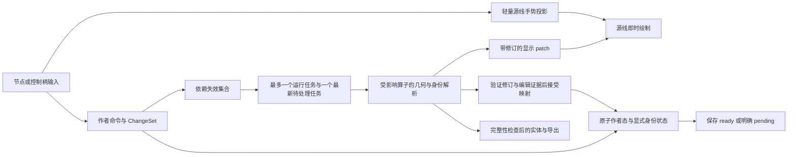

# 区域身份与编辑求值边界重构提案

日期：2026-09-26。状态：设计提案，尚未实现；当前行为以[构造链文档](construction-pipeline.md)为准。依据是[删点故障复审](../qa/spline-edit-failure-2026-09-26.md)，实施检查点见[工作包](../../tasks/region-identity-redesign-2026-09-26/README.md)。

## 问题定义

当前链路将三种不同的东西合并了：用户持续编辑的区域、一次求值使用的边集合、这一次几何结果的来源证明。Fill 将源 Edge 集合写入 key；Partition 又把上游 key 和边界签名嵌入新 key；赋值、构造输入、输出契约持久化这套递归字符串。删点时正确地生成一条新 Edge，却同时导致用户没有删除的面被重新命名。

六字段精确匹配可以准确回答“这两个引用是否完全相同”，不能回答“源曲线编辑后，哪个面仍是原来的面”。索引只改善前者。需要保留精确解析、歧义拒绝与修订隔离，替换持久身份的定义和传递方式。

另一条独立问题是交互边界：每次节点预览都携带完整 Document、重新投影完整显示工程，再按显示对象变化触发曲线、区域、浮雕、放置求值。即使面身份完全稳定，这条链也会阻塞源线编辑。

## 应当保持的不变量

- Document 是唯一作者态；UI 投影、求值结果和历史缓存不能成为第二个可写工程。
- 对几何集合和算子语义都不变的边拆分、合并、路径反转，不能让颜色、厚度或引用落到另一块物理区域。比较身份集合与区域总面积不足以证明这一点。
- 普通点/柄移动在区域拓扑保持且对应唯一时，持续编辑同一个区域；区域坐标变化本身不等于区域消失。
- 真正的分裂、合并、消失和不可判定情况是不同结果，不能按面积、中心距离、输出顺序统一猜测。
- 重开、撤销/重做、复制实例和冷求值必须得到同一对应关系；不能依赖上一帧面、多次操作之前的文件或 Worker 私有缓存。
- 有效几何、身份解析、外观解析、浮雕解析及制造完整性分别描述。未知颜色/厚度不能冒充已完成成品，但也不应抹除仍有效的源线和几何。
- 过期结果不得写入显示、作者态或持久化；求值不能在后台悄悄修改保存中的文档。

## 建议的数据边界

| 数据                           | 权威与寿命                         | 作用                                             |
| ------------------------------ | ---------------------------------- | ------------------------------------------------ |
| Shape/Program/Operator/Path ID | 持久作者态                         | 用户对象、操作和路径的连续身份                   |
| Vertex/Edge ID                 | 持久作者态                         | 当前曲线表示中的实体；拆分/合并允许改变          |
| BoundaryUse/Occurrence ID      | 持久作者态，具体 schema 待原型验证 | 区分一条路径的不同用途、方向基准及镜像/阵列实例  |
| Region ID / 输出槽             | 持久作者态                         | 外观、浮雕、制造及下游输入的短引用目标           |
| 区域选择器及确认记录           | 持久作者态                         | 冷求值时将 Region ID 唯一解析到当前候选面        |
| 边替换 ancestry                | 编辑事务证据，规范化后保留必要部分 | 记录拆分区间、合并顺序、反转映射；不等同于面身份 |
| 几何 fingerprint、来源 DAG     | 派生状态                           | 校验、失效传播与诊断；父来源按短引用共享         |
| UI 源线预览、区域 patch        | 会话状态                           | 显示当前手势或指定修订的求值结果                 |

Region ID 不是给每次求值随机生成 UUID。必须同时解决“重开后怎么找回对应面”。建议用稳定路径用途、实例、边替换关系、定向边界及交点/邻接关系构成结构化选择器，并在编辑事务中保存已接受的变更。完整历史不应无限追加；保留当前可独立解析的定义，撤销记录由历史系统管理。

最小持久区域槽应包含 Region ID、语义算子角色、稳定 BoundaryUse/实例引用、独立于当前遍历顺序的方向基准、规范化选择器及其改写版本。反转命令必须显式转换路径使用方向与左右关系，或让路径的当前遍历方向相对于原方向基准改变；不能用反转后的 `+/-` 标签重新给原 Region ID 定位。当前候选“恰好唯一”不是正确对应的证明。旧/新对应需包含命令产生的方向/区间映射，并以该命令预期的几何变换作见证；对于本次分区线反转，见证就是原物理面完全不变。

冷启动只解释已保存的槽定义并验证来源，不搜索一个看似合适的面来收养旧 ID；不能证明就返回 unresolved。几何哈希、采样段、交并面积及临时候选是可丢弃证据，不进入持久引用。来源 ancestry 规范化时不能擦掉方向变换等仍被选择器消费的语义。

每类算子必须声明身份行为：直接转发、显式实例化、一对一变换或产生新区域。Collect/Reference 不重复给上游面命名；Partition/Boolean 只在自己的输出边界管理新区域。固定单输出角色直接使用固定槽，不经过通用候选匹配。这能把复杂对应限制在真正改变面拓扑的位置。

不能先认定任何一个拓扑签名足以覆盖所有形状。自交、多次穿越、闭合环的循环起点、对称区域、重叠边和退化切点都必须进入原型反例集。若选择器不能唯一解析，就应明确 unresolved。这个设计改善确定可判定的编辑，不承诺任意拓扑改变都有唯一答案。

## 编辑与区域连续性

1. 源命令返回结构化 ChangeSet：源实体改动、边拆分/合并/反转映射、路径用途变化、pose、外观、浮雕与制造变化。不能只靠两个整文档是否相等判断所有域失效。
2. 求值计算候选几何及结构化来源；保留未受影响算子结果。先判定几何合法性，再处理区域连续性和赋值。
3. 对不受编辑影响的输出直接保持身份；对受影响输出用用途、实例、邻接和 ancestry 检查唯一的一对一对应。几何比较可验证结果或产生修复建议，但不能成为隐式作者态匹配权威。
4. 保持关系唯一时，在同一语义编辑中保留 Region ID 并更新选择器。真正分裂、合并或关系不确定时，显式产生新面和待处理绑定；只有明确的继承规则或用户选择可写入颜色/厚度。
5. 无法同步证明的连续性随源编辑原子写入版本化 `identityPending`，其中保留编辑标识、受影响槽和必要改写证据。此状态允许保存作者意图，但相关赋值不能作为 ready 消费，相关写入与成品导出拒绝；几何、源线及无关操作仍可显示/编辑。
6. 异步候选携带 epoch、base revision、ChangeSet 摘要、目标槽集合、身份规则版本及依赖指纹。主线程逐项匹配当前 pending 后通过命令边界原子接受，作为该语义编辑的完成；不得另塞一个不可解释的撤销步骤。后续编辑、撤销或换工程使旧候选失效，必须针对新的明确状态重算。

本提案选择“显式保存 pending”，而非将已编辑源几何与仍标为有效的旧绑定一起保存。重开 pending 工程后依靠文件内证据重新验证；没有充分证据就持续待处理。完成映射后产生新的保存修订，文件写入队列不能让较旧的 pending 或完成结果覆盖较新的编辑。

上述第 4–6 步必须先做最小原型：连续源编辑、自动保存、撤销、映射返回、保存失败重试同时发生时，不能出现半个编辑被保存，也不能将过期映射合入另一条历史。原型不过，不能切换文件协议。旧 `proposeAssignmentInheritance` 或空间匹配不得在普通编辑中绕过 pending 改写赋值；待处理期间赋值表保持原样。

## 快速交互与派生求值

- 手势基于不可变基线和局部 delta；源点反馈不等待 JSTS、浮雕或制造。取消丢弃 delta，松手仍只产生一次可撤销编辑。结构共享必须保持不可变约束，不能简单删除保护性 clone 后允许外部修改。
- 区域预览保留最后已接受的显示结果，并标注受影响部分 pending；它只能用于显示，不能用于新涂色、厚度绑定或导出。pending 不等于全局禁用源编辑。
- 外观变化只重新解析外观和显示；厚度/放置只使所需下游域失效；局部源编辑只使依赖它的算子及跨 Shape 使用者失效。pose、世界坐标引用、关系约束与实例必须列入实际依赖，不能仅按 Shape 缓存。
- 调度器在发送前合并请求，避免将旧 preview 排进 Worker 消息队列。同步几何计算不响应取消消息时，可先允许一个旧任务完成，但其后只执行最新请求；不能把主线程 Promise 被拒绝称作计算已取消。
- Worker 持有其求值缓存，返回 UI 所需的区域/诊断/状态增量。完整快照由检查/导出显式请求；短引用、共享来源 DAG 降低重复数据。实际传输和 clone 耗时要单独测量，不能用 JSON 长度替代。
- 每个结果带 epoch、revision、previewId、previewVersion 和求值域；即使请求已合并，也不能删除过期结果校验。

## 失败和诊断

将“几何无法构造”“面连续性无法确定”“某条赋值无法解析”“制造结果不完整”分别展示。根因需携带 Shape、算子、源路径、影响的绑定和后续阻断链；下游不能只覆盖成“输入端口不可用”。

仍可构造的面应提供几何预览，已确定的赋值可继续显示；未知部分用明确待确认状态。依赖未知颜色、厚度、切料或附着的成品导出继续拒绝。这个变化不是忽略契约错误，而是把不同有效性边界拆开。

## 替换与删除范围

| 当前职责/文件                                                             | 收敛方向                                                    |
| ------------------------------------------------------------------------- | ----------------------------------------------------------- |
| `construction/operators/regions/fill.mjs`、`regions/index.mjs` 的来源 key | 产生几何与结构化来源；持久区域由输出注册与解析层管理        |
| `surface-lineage.mjs` 的采样线段邻近归因                                  | 明确为几何证据；不再将容差命中结果直接当持久名字            |
| `regions/partition-identity.mjs` 的嵌套 JSON 解析/重转义                  | 旧格式导入适配保留；新运行路径通过 typed ID map 复制引用    |
| `construction/provenance.mjs` 的 lineage 子集继承                         | 收敛到明确的分裂/合并候选与冲突处理；不用作普通编辑自动修复 |
| 外观/浮雕/制造中的六字段长引用                                            | 统一的短区域引用和 occurrence；导入时完整解析一次           |
| `editing/dispatcher.mjs`、`editor/creation-runtime.mjs`                   | 作者提交与轻量手势展示分离，避免每次 pointer 发布全工程     |
| `evaluation/session.mjs`、`document-session.mjs`、`document-worker.ts`    | 单一调度与修订边界、合并请求、清晰消息所有权                |
| `evaluation/planar-stage-cache.mjs`                                       | 从整文档单条缓存变为明确依赖的算子缓存                      |
| `creation-workspace.tsx` 的对象相等 busy 判定                             | 按被操作输出是否具备当前有效结果判断                        |

新协议需要明确版本迁移，不能在现有 version 4 中悄悄改变引用含义。健康旧文件先按旧求值链精确解析，再生成新注册与引用，并对几何、外观、浮雕、制造逐项等价验收。已损坏旧文件保留原作者态与诊断，不能用空间最近面强行完成迁移。

所有消费者切换后，递归字符串解码只允许存在于旧格式导入中；删除正常编辑链的旧契约重写、重复匹配和兼容分支。不要长期同时维护两套可写身份模型。

## 不采用的捷径

- 对现有长 key 做 hash：只能减小表示，不能修复删点导致改名。
- 合并边时强占旧 Edge ID，或只把所有 Edge token 换为 Path ID：都缺少多用途、多交点、实例和真实拓扑变化的语义。
- 删除 outputContract、放宽 lineage 检查：几何可能恢复，赋值仍失效，且更容易错误绑定。
- 以最近中心、最大面积重叠、数组顺序回填样式：可能静默串色、串厚度；只能用作明确展示的修复建议。
- 放宽归因容差、增加 debounce 或隐藏更新提示：不能消除错误身份或同步复制成本。

交付标准是“基础编辑后，几何与作者意图仍对应，而且编辑响应不等待全链路”，不是“静态示例能打开、截图好看或当前全部测试通过”。
