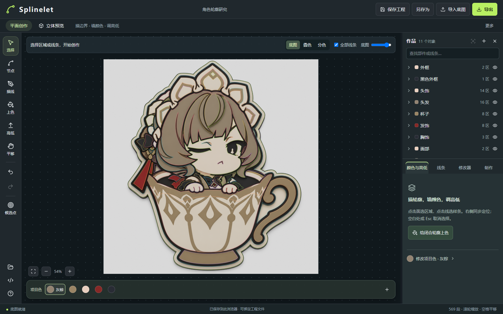
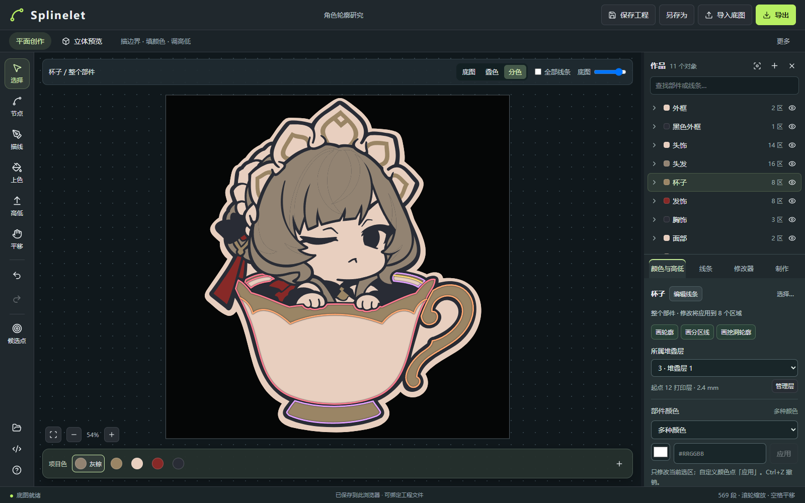

# Splinelet 上手指南

## 1. 从图片新建工程，建立部件

点击左上角 Splinelet 菜单中的「从图片新建工程…」，选择 PNG、JPG 或 WebP。这会替换当前工程，操作前先保存需要保留的内容；已有 `.spl` 工程可从同一菜单的「打开工程…」继续。旧 `.bezier.json` 工程仍可导入，下次保存时会创建 `.spl`。

旧工程转换若存在无法保持的联动或失效输出，工作区会显示可展开的迁移注意事项。请按具体提示检查受影响内容；转换报告不会混入保存的几何数据。

在右侧作品树新建部件，双击名称改名。按可独立编辑的部分组织作品，例如外框、头发、杯子，而不是每条线都单独建一个部件。选择「底图」显示方式，便于对照参考图描线。

## 2. 沿轮廓落点，调整曲线

选择「画轮廓」或描线工具，依次点击关键位置。算法只计算两点之间的控制柄，节点的数量和位置由你控制。

- 按住 **Shift** 落点：临时取消吸附。
- 按住 **Alt** 落点：取消吸附与拟合，使用直连。
- 选择工具只选中和框选，不拖动形状。用节点工具调整锚点和控制柄，支持当前路径内多选节点一起移动；开放曲线可以从头或尾继续画。
- 用 **C** 闭合轮廓。遇到复杂分岔时主动增加落点，比强行一次拟合很长的曲线更可控。

## 3. 分区、挖洞，给局部上色

闭合轮廓确定基础范围。在部件内画分区线，将一个区域拆成多个区域；闭合的挖洞轮廓用于扣除面积。分区线应贯穿目标区域，不能只在面内悬空结束。

使用「上色」给区域填色，或在右侧“选区”中的“颜色”“浮雕”“叠放”页分别修改颜色、厚度和上下位置。选整个部件会作用于其多个区域，编辑前先看详情栏的选择范围；区域选区的叠放页只显示该区域的实际位置。项目色卡位于“工程 → 色卡”；修改色卡会联动引用它的区域。

平面默认使用「叠色」，同时显示参考图、源线和修改器求值后的面。「底图」「叠色」「分色」只改变显示方式，切换工具会保留已选显示方式。单选一个部件或它的区域时，可在“选区 → 构造”组合分区、布尔或偏移步骤；这些操作不改写源贝塞尔节点。需要整理全工程的构面来源、体块或零件时，从“工程 → 设置 → 工程高级构造”打开编辑器。

如果移动轮廓使既有分区不再成立，查看构造链的错误并修复源线；确实要改变结构时，再明确重建输出或移除相应步骤。应用不会把失效区域悄悄替换成另一块面。

## 4. 安排堆叠层，再设置局部厚度

在“工程 → 分层”中设置打印层高并启用分层，新增堆叠层；选中部件后，在“选区 → 叠放”中将它分配到相应层。若一个部件的区域已有不同叠放位置，页面会明确显示混合状态；选择一个层会统一该部件的全部区域。

这里有两个不同的概念：

| 概念     | 用途                                                                         |
| -------- | ---------------------------------------------------------------------------- |
| 堆叠层   | 安排部件上下关系。上层起点跟随下层最高点；层数和名称由你决定。               |
| 打印层高 | 一次打印层的物理高度，例如 0.2 mm。区域厚度按整数打印层设置，8 层即 1.6 mm。 |

切换「立体预览」检查形状和层次。下层增厚会抬升其上方各层；修改打印层高会保持层数，改变物理厚度。不同区域仍可有各自的厚度。

有完整底层轮廓时无需另加底板。可在“选区 → 承托”使用“生成承托部件”；它是可选的引用外形与外扩操作，不是每个作品的必经步骤。

## 5. 检查、保存、导出

顶栏左侧显示工程名称与保存状态，右侧提供保存和导出入口；「导出」打开右侧检查与导出面板。在“工程 → 设置”中设置底图对应宽度（工程物理比例），在“工程 → 导出”选择要输出的零件、执行“检查可打印实体”并导出。工程尺寸以毫米计算；源线导出的比例按整张底图宽度换算。

| 格式                 | 用途与边界                                                                                               |
| -------------------- | -------------------------------------------------------------------------------------------------------- |
| **通用 3MF**         | 默认打印导出。包含分色实体、毫米尺寸与相对位置，不绑定打印机。到切片软件再选择机器、耗材和工艺。         |
| **Bambu 工程 3MF**   | 可选折叠入口。从已有 Bambu 工程读取配置模板，携带部件耗材编号和切片参数；实际 AMS 槽位在切片软件中选择。 |
| **分色 SVG**         | 导出已填色区域与孔洞；派生边界按计算精度采样。                                                           |
| **源线 SVG**         | 从“工程 → 导出 → 源曲线 SVG”导出可编辑的原生三次贝塞尔路径。                                             |
| **Blender Python**   | 在 Blender 的 Scripting 工作区运行，创建最终实体及独立隐藏集合中的源贝塞尔。当前实体导出为单一材质。     |
| **Splinelet `.spl`** | 原生可编辑工程，保存底图、源线、构造关系、颜色和层设置。                                                 |

STL 保留在兼容 API 中。通用 3MF 不带切片软件的专有配置。Bambu 可能提示「仅加载几何」，部分软件需要重新指定颜色／耗材；这不等同于模型几何损坏。格式细节见 [3MF 导出说明](3mf-export.md)。

高级构造编辑器还可导出“构造面数据 SVG”，仅包含其中所选或全部旧构造配方的派生面轮廓，不包含后续修改器和体块；它不是成品导出。主要的实体检查、3MF、Blender、分色 SVG 和精确源曲线 SVG 都在“工程 → 导出”完成。

源曲线导出窗口中的“挤出厚度”控制源曲线 Blender 脚本的挤出值；编辑作品区域的厚度请使用“高低”工具或区域属性。

**Ctrl+S** 首次选择文件后绑定保存，之后每次按下 Ctrl+S 或点击顶栏「保存」才写回同一文件；**Ctrl+Shift+S** 另存为。编辑后的恢复草稿会自动保存，供刷新或意外关闭后恢复，但草稿不是文件备份的替代品。不支持文件访问 API 的浏览器会下载 `.spl`。格式细节见 [Splinelet 工程格式](project-format.md)。

## 常用操作

左侧「变换」默认进入移动；G / R / S 直接进入移动、旋转、等比缩放，变换采用先选后拖：首次按下未选部件只选中，拖动已选对象或选框移动，四角等比缩放，顶部圆柄围绕中心旋转。三种操作共用变换选框，选框、轮廓与实时数值同步；缩放默认固定对角，按住 Alt 以中心缩放，Shift 约束移动方向或按 15° / 10% 步进。拖动期间只显示预览，Esc 取消，松手提交一次可撤销的修改。模式按钮与属性面板同步，换选对象时保持变换面板打开；在输入框、重命名、弹窗或拖动中不会触发模式快捷键。

| 操作                         | 快捷方式                             |
| ---------------------------- | ------------------------------------ |
| 选择 / 节点 / 描线           | V / A / P                            |
| 变换：移动 / 旋转 / 等比缩放 | G / R / S                            |
| 平移画布 / 缩放              | 右键、空格或中键拖动 / 滚轮          |
| 取消选择或当前操作           | Esc；空白单击取消选择                |
| 撤销 / 重做                  | Ctrl+Z / Ctrl+Shift+Z                |
| 作品树改名                   | 双击名称；箭头单独负责展开           |
| 三维视角                     | 左键拖动旋转，右键拖动平移，滚轮缩放 |

详细节点、路径、合并、续画和兼容 API 操作见 [源线编辑器手册](source-editor.md)。属性栏竖排分为“工具 / 工程 / 选区”，当前按钮向右与内容区连成一个面板；没有选择时不显示“选区”。部件和区域按“形状、颜色、浮雕、叠放”分开显示，单个部件还提供构造、承托和输出页；源线只显示源线页，场景组只显示层级页。需要两线围面、构面布尔、凹槽／贯穿或零件定义时，从“工程 → 设置 → 工程高级构造”打开高级构造编辑器。选中一个部件或仅属于它的源线、区域时可选择其派生曲线预览阶段；取消选择后恢复完整结果。
