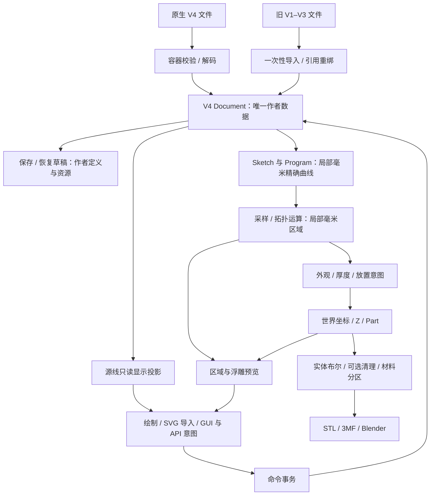

# 原始数据到最终输出的数据流审计（2026-09-26）

审计基线：`f181bb1`。本轮只读审阅产品代码，使用内存副本、既有 fixture 和针对性 Node 回归；没有修改产品逻辑、打开用户工程或进行原生/浏览器端到端验收。

结论：**V4 作者态 → 派生求值 → 视图/导出的主干已经清晰，但导入边界的语义保真与诊断传递仍不够可靠。** 已复现两项导入问题；现有 V4 编辑/制造链未复现重复变换、单位混用、预览回写作者态或部分失败仍导出的缺陷。此结论不代表穷尽全部文档和拓扑组合。

## 实际数据流

参考图及其仿射属于作者文档中的参考资源；图片像素不会自动变成几何权威。显示像素通过明确的 source frame 与世界毫米坐标转换。采样点、区域多边形、三角网格及 UI facade 均不是新的可编辑源线。

| 边界            | 当前责任与验证                                                                                       |
| --------------- | ---------------------------------------------------------------------------------------------------- |
| 文件 → Document | `open-project.mjs` 分流；V4 codec 验证容器、schema、资源摘要；旧格式只导入，不直接覆盖原文件         |
| 意图 → 作者态   | `editing/dispatcher.mjs` 拥有文档/preview/history；命令重新检查修订、稳定引用和权限                  |
| 作者态 → 求值   | `evaluate-document.mjs` 组装 curves、regions、relief、placed-relief、bodies；Worker 只接收和返回 DTO |
| 局部 → 世界     | 跨节点引用使用接收方世界矩阵的逆与来源世界矩阵；制造放置应用所属节点世界矩阵                         |
| 求值 → 显示     | source/creation/workspace/studio-display 是只读投影，GUI 回写重新进入命令                            |
| 求值 → 成品     | 读取已提交修订的完整 BodySet；blocked 聚合没有可供导出的部分 value                                   |
| 并发 → 当前结果 | epoch、revision、previewId/version 和请求域共同校验；迟到结果不覆盖当前状态                          |

实现入口：[求值总装](../../src/lib/evaluation/evaluate-document.mjs)、[编辑会话](../../src/lib/editing/dispatcher.mjs)、[坐标变换](../../src/lib/scene/transforms.mjs)、[求值会话](../../src/lib/evaluation/document-session.mjs)、[导出适配](../../src/lib/editor/creation-output.mjs)。当前主干契约见[构造链文档](../architecture/construction-pipeline.md)。

## 已复现的问题

### 1. 共享轮廓的不同体块被转换为同一输出，导入成功但随后无法求值

触发条件：合法旧工程的两个 feature 共用一个 Region，各有自己的高度/依附关系。基于已提交的 `v3ProgramProject()` fixture，将 `support` 与 `body` 都指向 `face`：support 高 5 mm、底面 0；body 高 1.2 mm，依附 support 并偏移 0.4 mm。移除 fixture 的打印层、surfaceGraph 与禁用修改器，避免其他行为参与。

实测结果：

- 旧 `evaluateCreation` 返回两个 cell，分别为 Z `[0, 5]` 和 `[5.4, 6.6]`，errors 为空。
- `importLegacy` 返回 `status: ok`，issues 为空。
- 导入后的 V4 RegionSet 和 relief 均为 `blocked`，诊断为 `duplicate-output / 集合输入重复发布了同一区域`。

原因：[legacy-import.mjs](../../src/lib/document/import/legacy-import.mjs) 第 625 行按 region ID 复用构造结果，第 1899 行又对每个 feature 发布该结果，第 2410 行把重复端口放进 collect。不同体块实例因此共享了同一个 OutputRef。第 2828–2835 行完成绑定后仅按已收集的 warning 决定成功状态，没有发现最终发布阶段被阻断。

这是明确的兼容性缺陷。**不能简单去重 collect 输入**：两个 feature 的厚度和放置不同，去重会继续丢失作者语义。应为不同体块保留独立输出实例/放置身份，或在无法无损表达时明确拒绝导入并返回可理解的原因；导入验收还应核对最终发布状态、区域/体块数量和逐项属性。

### 2. 依附关系变为固定 Z 后，告警被丢在宿主边界之外

在上述 fixture 增加 `replacedFeatureIds: ['support']`：旧引擎只发布 body，但仍通过 support 的作者定义算出 body 底面 5.4 mm。

导入器的明确兼容行为是把该依附变为 `{ kind: 'free', zMM: 5.4 }`，并返回 `attachment-flattened-unpublished-target` warning，说明后续支撑厚度变化不再联动。初始外形可保持，但编辑语义已经改变。

实测 `importLegacy` 返回 `ok-with-warnings`，V4 placed-relief 为 `ready`；将同一打开结果交给真实 `createStudioSession` 后，`getSnapshot()` 中没有该告警。全库读取核对也未发现 Studio UI 消费该导入 report 的路径。证据链：

- [legacy-import.mjs](../../src/lib/document/import/legacy-import.mjs) 第 1683–1694 行产生固定高度与语义降级告警。
- [open-project.mjs](../../src/lib/persistence/open-project.mjs) 第 39 行保留 `legacy.report`。
- [studio-session.mjs](../../src/lib/editor/studio-session.mjs) 第 132–138 行发布 snapshot 时没有报告字段；持久化状态同样不保留它。

这是明确的诊断传递缺口。需要让导入报告进入当前打开会话，并向用户列出受影响对象、发生的降级和修复入口；关系丢失等重要降级需要明确的处理策略，不能只依靠导入器内部 warning。无需把完整历史导入报告混入几何求值输入。

两个最小复现和断言保存在本地忽略产物 `outputs/data-flow-audit-2026-09-26/migration-probe.mjs`，实际输出为同目录 `migration-results.json`。它们未修改 fixture 原件。后续修复应将上述反例纳入正式迁移回归；当前既有 `test-v4-migration.mjs` 仍通过，说明覆盖尚缺这些组合。

## 需要收紧、但尚未证明造成错位的边界

1. **显示 facade 仍伪装成旧 `Project` 类型。** [use-studio-project.ts](../../src/hooks/use-studio-project.ts) 第 19 行以 `as Project` 暴露投影；运行时实际冻结对象并用 WeakMap 校验来源。当前未发现第二写权威，但类型系统不能阻止未来代码把显示投影当成作者数据。建议明确命名 `StudioDisplay`，标为深只读，并将 scene/modelView 等求值结果作为独立类型传递。
2. **facade 与求值 scene 的刷新节奏不同。** `creation-runtime.mjs` 按编辑状态缓存显示对象，求值另外返回 scene/modelView；当前消费者使用正确来源。未来从 `project.creation` 读取新求值摘要有误用风险，应让类型与字段命名表达“作者摘要”或“某修订求值结果”。
3. **当前文档存在旧流程残留。** [3mf-export.md](../3mf-export.md) 的“几何链路”仍写 `compileCreation → buildSolid`；默认 V4 宿主实际使用 `evaluateDocument → BodySet → creationOutput/pack3MF`。产品主体已迁移，文字却指向旧装配，增加排错和后续改动误入兼容层的风险。当前权威链应统一到构造链文档，历史链明确标注适用范围。
4. **身份编码仍与来源展开高度耦合。** 上一轮索引优化减少了重复比较，但持久化嵌套 key、lineage 和复制重映射仍有复杂性。当前未发现误绑反例；其体积及 CPU 问题已有[性能验收](identity-optimization-2026-09-26.md)。后续来源结构重构需版本化迁移，不应截短身份或弱化匹配条件。

## 已确认受控的特殊处理

- **像素/毫米和 Y 轴转换**：源投影执行 local → world → pixel，编辑反向转换；主参考图仿射无法精确表示时拒绝，不猜测一个近似坐标系。SVG 的 Y 翻转、Blender 的 mm→m 位于导出边界。相关 source-view、source-runtime、source-scale、object-transform 与 export-view 回归通过。
- **曲线采样与确定精度网格**：精确曲线到面本来就有毫米容差；`fill.mjs` 自适应采样，`region-engine.mjs` 的固定细网格用于消除拓扑数值噪声。不能把所有离散化都当作隐式几何修复，也不能把派生多边形重新当源曲线。
- **制造清理**：开启后执行派生截面的 `buffer(r) → buffer(-r)`，确实会改变细节；源 RegionSet 不变，主实体与材料分区使用同一截面并做体积校验。UI 和[构面文档](../modeling-2026-09-19.md)已提示此影响。
- **不同导出格式的放置**：通用 3MF/STL 保留 BodySet 坐标；Bambu 适配会将装配居中并抬升底面到 Z=0，各部分相对位置保留。这是[已说明的格式特性](../3mf-export.md)，不是重复求值造成的随机偏移。负 Z 的自由放置在这两类导出中会体现不同绝对位置，应按目标格式理解。
- **失效与迟到结果**：失效 selected 不退化为 all，赋值冲突不被索引覆盖，blocked 结果不能用于成品；缓存与旧 Worker 结果通过身份校验拒绝。取消尚不停止后台计算属于响应性能边界，本轮未发现它造成错误结果接入。

## 本轮验证与建议顺序

已运行并通过针对性 Node 回归：迁移、Worker 协议、平面缓存、参考图求值复用；源投影/回写、Studio display/session/host、workspace、路径与节点意图、修改器意图/运行时、源比例、对象/节点手势、曲线预览、事务；浮雕制造、完整求值、实体、真实样例实体、导出及导出视图、creation view、cleanup、scene 和 review-repairs。

另只读打开内置 Sandrone：当前仍走 legacy 导入，报告为 `ok`，17 条记录均为 info，没有 warning/error。上述两个缺陷由最小组合反例触发，不能据此断言内置样例或所有旧工程已经丢失关系。

没有为只读审计重跑全库构建或操作真实浏览器/Tauri；上表结论主要来自源码、针对性测试和两个新的内存反例，不能替代后续修复的双端验收。

建议先修复 **共享 Region 多 feature 的无损导入**和**重要导入告警的可见性**，补入语义保真的差分回归；随后收紧只读显示类型与同步文档。继续性能优化时，保持作者文档、几何版本、引用身份、显示帧和导出放置这几个边界明确，避免以隐式默认值或自动重绑填平错误。
