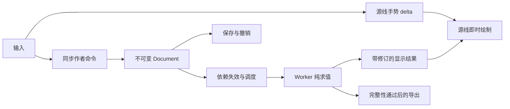

# 区域定义与纯求值架构决策

日期：2026-09-26。状态：已撤回的实验设计快照，不是当前架构决定。该方案改善了匹配错误与诊断，但仍将作者属性绑定到动态分区的一面，未解决需求建模问题。后续方向见[区域作者模型与求值职责](../architecture/region-identity-redesign-2026-09-26.md)。以下保留当时论证，不能作为当前产品承诺。

## 决策

采用**声明式区域定义、带来源的平面构造、单向纯求值**。持久 ID 标识用户定义的目标；一次求值得到的 polygon/cell 只是这个目标在当前源数据上的实现。

文档保存源曲线、构造操作、区域选择条件和属性。求值只解释这些定义，不比较上一帧猜测身份，不自动重新绑定，不回写工程。源线手势即时反馈，派生几何独立调度。只有显式作者命令可以改变区域定义。

撤回初稿的 `identityPending` 文件字段、Worker 返回映射后更新作者态、补齐同一历史步骤等机制。它们会把“计算尚未结束”混入持久语义，并制造保存、撤销和晚到结果之间的第二条写入链。新设计中未求值和求值后 unresolved 都是派生状态，无需保存。

这不是用新 UUID 包裹旧签名：关键是目标的可解释定义、逻辑曲线基准和来源传递。三者不能实现，就不能切换协议。

## 从用户意图推导边界

1. 用户编辑的是曲线形状及构造关系。为表达同一条曲线增加/删除控制点、改变遍历方向，不应删除其构面含义。
2. 用户赋颜色/厚度时指定了一个目标。目标可能是“这个操作的全部结果”，也可能是“这几条逻辑边界围成的一个面”；两者不能混为“当前第 N 个 polygon”。
3. 源编辑可以改变几何，甚至令目标不再存在。持久定义仍应存在，求值报告缺失或歧义；不能删除作者数据，也不能偷偷选择另一面。
4. 保存需要记录用户意图，不需要等待面、实体或缓存计算。撤销恢复一次作者修改，求值只随恢复后的文档重新执行。
5. 源点/控制柄反馈只需要当前源几何。区域着色需要当前区域结果，实体导出需要全部相关制造结果；这些操作不应共享一个全局 busy。

形式化约束：`Result = Evaluate(Document, evaluationSemanticsVersion)`。关闭缓存、换进程、重开工程都必须得到同样的语义结果。`Evaluate` 前后文档编码必须相同。缓存只能省计算，不能决定结果含义。

## 比较过的方案

| 方案                                          | 优点                                 | 决定                                                                            |
| --------------------------------------------- | ------------------------------------ | ------------------------------------------------------------------------------- |
| 压缩现有 key、增加缓存或放宽契约              | 改动小                               | 不解决源表示变化和反转错面；不作为清理方案                                      |
| 面积/中心/种子点/最近面自动重绑               | 常见静态案例容易工作                 | 目标移动、狭窄区域、分裂合并时可能换面；不作隐式语义                            |
| 通用 CAD 历史命名，保存所有生成/修改/删除关系 | 可支持依赖特定建模历史的子形状       | 当前几何流程已丢来源，且会增加历史与重计算协议；不为此项目引入完整通用 CAD 框架 |
| 将平面图/面作为第二份可写作者模型             | 面可以直接持有 ID                    | 与样条重复保存几何和拓扑，编辑/导入/撤销都需同步；不采用                        |
| 声明式区域定义 + 带来源的派生平面图           | 冷求值可解释、保存简单、错误范围清晰 | 采用；只支持有明确定义的选择，拒绝猜测                                          |

不否定“种子点选择”作为将来显式功能：如果用户明确选择“包含这个锚点的面”，那是另一种可理解语义。不能悄悄把现有涂色变成该语义。同样，稳定 ID 本身不解决“如何找到面”。

## 持久数据：只保存定义

| 数据                                       | 含义与所有权                                                           |
| ------------------------------------------ | ---------------------------------------------------------------------- |
| Node/Program/Operator/Path/Vertex/Edge     | 保留现有作者实体；Vertex/Edge 是曲线表示，不是面身份                   |
| Path basis                                 | 路径的逻辑方向及必要参数基准，独立于当前 Edge 数组顺序、分段和显示起点 |
| Curve use                                  | 某个算子端口对逻辑曲线的一次使用；区分路径、用途、实例和方向变换       |
| Region definition                          | 持久短 ID + 所属操作结果 + 声明式选择器；仅命令创建/修改/删除          |
| Appearance/Relief/Manufacturing assignment | 引用 Region definition ID；默认值、实例覆盖仍分别表达                  |
| Evaluation semantics version               | 固定选择器语言、拓扑/精度策略的解释版本；升级必须迁移或确认            |

持久结构的领域边界：

```ts
type RegionDefinition = {
  id: RegionDefinitionId;
  context: OperationResultRef; // 短引用，不嵌套上游的完整内容
  selector: SemanticResult | CellBoundarySelector;
};

type OperationResultRef = {
  operatorId: OperatorId;
  role: DeclaredOutputRole;
  occurrence: OccurrenceRef;
};
```

`SemanticResult` 指算子声明的语义结果，允许由多个 polygon 组成；不是“当前碰巧只有一个面”。`CellBoundarySelector` 指在指定结果中由明确边界条件围成的一面，必须恰好解析到一个面。不能失败后自动从后者降级为前者。

只为被作者引用的目标保存定义。实现沿用 OutputRef 的结构作为兼容外壳：`key=definition.id`、`lineage=[]`，其余字段与 definition.context 一致。临时面使用 `cell:` 内容句柄，包含当前上下文、选择器和几何摘要；GUI/API 另外检查 epoch/revision。作者事务重新验证候选后绑定定义，codec 拒绝临时句柄、不一致引用与定义循环。

区域定义、算子和引用都进入同一依赖图：定义依赖其 context 和源条件，消费它的算子依赖该定义。创建/改写时检查环路，禁止定义通过下游算子间接依赖自己。持久引用的长度与建模链深度无关；共享表达式按 ID 引用，不能把查询树再次序列化进 ID。

## 逻辑曲线基准：先解决表示等价

Curve use 引用逻辑曲线，而不是当前 Edge ID 列表。源命令必须明确维持或改变其语义：

| 命令              | 源数据处理                                               | 区域定义处理                                             |
| ----------------- | -------------------------------------------------------- | -------------------------------------------------------- |
| 拖点/拖柄         | 更新当前几何；不改逻辑方向/用途                          | 通常不改定义；当前几何使选择条件失效时返回 unresolved    |
| 精确拆边          | 新边覆盖原来的逻辑参数域，并携带显式分段映射             | 不改围面含义；不以新增 Vertex/Edge 重命名面              |
| 删点/合并拟合     | 保留路径的逻辑方向与顺序；几何拟合与逻辑区间映射分别记录 | 命令能够解释的区间保持；删除的语义锚点不能按“最近点”补回 |
| 反转路径          | 反转表示，同时反向更新表示到逻辑基准的映射               | 普通分区含义不变；不重新根据当前遍历方向计算左右身份     |
| 闭环换起点        | 改显示接缝；必要参数坐标同步按周期变换                   | 边界环按循环序列解释，不依赖数组首项                     |
| 镜像/阵列/复制    | 显式传递用途与实例；复制按 typed ID map 重写源引用       | 镜像同时传递方向奇偶性；不能用世界 CCW 重新解释原侧别    |
| 删路径/改构造用途 | 明确删除/改变语义来源                                    | 原定义保留并报告缺失，或由同一显式命令处理引用           |

Path basis 不以几何弧长或全局 x/y 排序偷偷重建。参数是作者域坐标；细分、反转、循环平移的映射由命令给出。若合并不同语义用途或删除被命名的锚点使映射不可定义，保留明确失效引用或拒绝该原子操作，不能伪造一一对应。

普通点/柄移动不应该每次更新区域选择器，更不应要求每次 Worker 返回后补写参数映射。精度、实际交点和采样段属于求值域。

### 可实施的参数基准

在 Path 的每个 Edge use 上保存有向 `basisSpan: [a, b]`，而不是在共享 Edge 几何上保存。use 的局部贝塞尔参数 t 与逻辑参数 u 满足 `u = a + (b - a) * t`。开放路径可在端部扩展域而不重新编号旧区间；闭合路径使用持久周期域，显示接缝不决定逻辑原点。初始赋值来自创建命令，不随当前弧长或坐标重排。

- 在局部 `t=s` 精确拆分：中间逻辑坐标 `m=a+(b-a)*s`，两个新 use 分别为 `[a,m]`、`[m,b]`；由 de Casteljau 保证定义的曲线函数不变。
- 纯表示反转：`c'(t)=c(1-t)`，span 变成 `[b,a]`。代入后逻辑曲线 `C(u)` 不变，不需要改区域定义或等 Worker 来纠正左右。
- 同一路径的连续区间合并：新拟合曲线覆盖合并后的有向域，并明确采用新的参数化。只保证逻辑域连续，不伪称几何完全等价；区域条件在新几何上重新求值。
- 跨逻辑基准合并：Path 的 basisCatalog 保留原命名空间，新桥使用独立基准。跨基准删点用有序 `basisPieces: [{t, basisId, span}]` 将两侧显式映射到新曲线；pieces 连续覆盖整个局部 t 域。resolver 按 pieces 精确分割曲线，只解释来源，不反查几何。整条路径改变分段时，命令要求完整的 basisPieceMapping；标准源编辑意图同步生成明确重参数化。
- 闭环跨接缝的区间按周期域表达；不得把原点重新吸附到某个现存顶点。删除显式语义锚点仍是删除，不以保留参数域掩盖它。

该数据量由当前 use/来源区间决定，不保存旧曲线快照。上述公式是源命令的规范语义；V4 首次迁移只为当前源建立基准，不声称恢复用户过去的全部编辑历史。

“反转时定义不变”仅适用于纯表示反转，且选择器全部引用逻辑基准的情况。若命令改变的是算子的方向语义，则必须显式改变 use/定义或产生未解析结果；不能套用表示等价规则。

方向解释统一在 occurrence 的逻辑局部坐标中进行。表示到 basis 的方向、curve use 的方向及实例变换的行列式符号必须组合后再解释 side/环条件，不能仅采用输出坐标的 CCW。镜像回归比较的是 `新区域 = 镜像变换(原区域)` 及其属性，而不是要求它仍位于世界坐标的同一侧；奇数/偶数次镜像分别验证。不可逆变换不能被当作正常方向变换。

## 区域选择器：定义目标，而非匹配旧面

选择器在用户选中一个当前面时建立，其边界条件必须能由源定义独立解释。最小语言由以下元素构成：

- 明确的操作结果与 occurrence；不能跨操作、跨实例搜索。
- 一个外边界循环及明确的孔边界条件。循环保留邻接顺序，允许循环移位，不能排序成无序 token 集。
- 每段边界对应逻辑 curve use、规范方向以及必要的语义端点/区间。相邻段只有在来源和方向连续且没有语义事件时才可折叠；采样节点不算语义事件。
- 端点可以是作者锚点、算子声明的生成端点，或在明确源域内可唯一确定的交点。交点必须带所涉及用途、区间域和交叉/接触等约束。
- 多次相交不能补成“第 N 个交点”。需要明确的源级区间/锚点来区分分支；无法表达时不能生成一个貌似稳定的选择器。

交点条件包含来源分支与逻辑参数域。完整的来源环、方向和孔洞条件若已唯一表达一个面，各交点使用全域；不能因为同一对曲线在别处相交，就额外限制一个已能唯一表达的面。整体仍有歧义时，作者绑定命令从持久 basis 的规范二分域构造区分条件并保存。求值不会随交点位置移动或扩大这些域；越界可能产生 missing/ambiguous，不能用旧面位置兜底。唯一性最终检查完整面条件，不能把每个交点必须单独全局唯一当成额外限制。

端点自动接边属于算子明确声明的切割路径延续。几何 DTO 仍分别标注原曲线和生成接边段，选择器将二者解释为同一逻辑 cutting use，并沿端部扩展参数域。原曲线终点从底面内移动到面外时，生成接边段可出现或消失；这不改变切割用途，也不应改变相邻面的持久定义。该语义有独立最小回归，不根据示例坐标特判。

解析仅得到 `resolved / missing / ambiguous / unsupported / geometry-invalid`。唯一性是必要条件，不是全部证明：还必须满足方向、实例、边界循环、端点和来源完整性。任何一个条件缺失都不能选“剩下那个候选”。

只有两个纯数字 ID 的对称面，如果作者数据没有任何可区分语义，就不可能推导用户想保留哪一个。不能以更多 hash 或评分掩盖信息缺失。复杂自交、同一曲线反复切割、重合边要么能从上述条件区分，要么需要显式命名源区间/区域构造，再由用户选择；不自动扩大为模糊匹配。

这里的保证是：在保持逻辑用途、方向及相关拓扑关系的编辑下，选择器保持同一语义区域。它不是“无论如何改线，都能推断作者希望追踪哪块旧几何”。对于表达不出的目标，应提供明确的源级区域定义能力；不得静默降低已有功能。当前示例及所有已有可独立赋值案例必须通过表达能力门禁后，才能发布新协议。

### 反例如何得到正确结果

- **共线删中点**：改变两段 Edge 为一段；逻辑 curve use、方向、交点和边界循环不变，定义不改，面及其属性不换身份。
- **反转分区线**：表示方向反转但逻辑基准不变；红色/1.25 mm 仍解析到原半区，蓝色/2.5 mm 仍解析到另一半区。
- **一般小幅变形**：几何坐标变化，但逻辑边界关系保持，选择器解析到变形后的面，不比较旧面面积或重叠率。
- **真实分裂/合并**：单面选择器若不再满足其条件即 unresolved；显式的整结果定义继续表达整个结果。是否把旧属性分配给新面是作者操作或事先声明的算子规则，不是通用继承猜测。
- **候选数量相同但对应换面**：逐定义比较规范方向和边界条件；数量相同不能跳过检查。测试必须核对颜色/厚度实际作用的几何。

## 派生几何：从源头携带来源

旧 V4 的 `sampleCubic → GeometryNoder → union → Polygonizer` 将用途、方向和参数逐步丢掉，再由 `contourSignatures` 按中点距离找回来源。V5 使用带来源的采样、切分与半边构造替换这一过程。

当前 V5 管线：

```text
精确曲线及逻辑用途
  → 带方向/参数区间的采样线段
  → 带来源的 noding
  → 合并重合原子边时合并来源集合
  → 派生半边图及面/孔邻接
  → 解释区域定义
  → 外观/浮雕/放置/实体
```

保留现有几何核的可用部分。`tagged-arrangement.mjs` 使用携带 data 的 JSTS `NodedSegmentString`，split 继承来源；在已知父段上计算参数区间，不按几何距离反查未知来源。

这要求 Fill 和所有产生边界的 Region 算子都输出来源完整的边界图，不能只给 Partition 的 cutter 加标签。生成的 offset/stroke/closure/endpointJoin 边必须有操作角色和来源；虚拟接边不能伪装成原曲线。做不到时，几何仍可作为整结果消费，但不能谎称支持精确的子面选择。

JSTS 继续处理采样多段线的 noding、布尔、buffer 和验证；没有来源保证的返回值不能直接作为新选择器依据。当前适配层负责半边构建、重合来源集合、孔洞和重复顶点边界拆解，并对生成面检查有效性。CGAL 的带历史 arrangement 区分输入曲线和由其诱导的图边，提供了职责划分的参考；本项目没有引入 CGAL/WASM。[CGAL 官方说明](https://doc.cgal.org/latest/Arrangement_on_surface_2/index.html)

只使用一套明确的毫米精度策略。采样、snap-round、布尔容差与用户 endpointJoin 策略分开记录，派生结果报告退化/来源冲突。删除身份链中的固定距离二次归因，不能通过增大容差消除歧义。

## 各算子的身份职责

| 算子                                | 新职责                                                                                                   |
| ----------------------------------- | -------------------------------------------------------------------------------------------------------- |
| Source/filter/transform/Join        | 传递或显式组合 CurveUse 与参数/方向映射；不把 Edge 列表变成区域身份                                      |
| `region-collect`                    | 转发区域定义引用；不重新命名，重复引用有明确诊断                                                         |
| `region-reference`                  | 显式引用实例，保留被引用定义与本次 occurrence，允许独立覆盖                                              |
| `offset`、Boolean 的每个目标结果    | 声明语义结果槽，可为 MultiPolygon；不能因分成几块就自动创建多个作者区域                                  |
| `region-array`                      | 按算子声明的实例角色生成 occurrence；排列位置只有在本身就是作者语义时才作为角色，不采用 polygon 遍历序号 |
| Fill/path、stroke、between、outline | 声明结果及来源；全结果属性无需枚举几何组件，独立子面属性使用显式区域定义                                 |
| `partition`                         | 生成带来源的候选面与邻接；独立面定义由选择器表达，不保存“整个输出成员集合必须永远相同”的契约             |

新曲线或新面出现可以改变当前候选集，但不能让所有已有定义因成员集合不同一起失效。只重新解释受影响定义；下游是否失败由实际引用和制造依赖决定。

赋值优先级也必须显式：部件默认、构造规则声明的继承、区域覆盖、实例覆盖分别有类型和来源。创建分区命令可按已声明规则为子区域建立初始属性关系；后续普通拖点不再运行通用“父 lineage 子集”继承。两个定义落到同一几何时按明确的覆盖层级解析，同级冲突必须报告，不能按对象/数组顺序取最后一项。浮雕加料/切料的合法叠加继续由制造语义判断，不能简单按几何重叠去重。

## 保存、撤销与并发：一条写入链



图中没有 Worker → Document 的箭头。命令需要新选面结果时，可先异步准备只读候选，再核对基准 revision 并一次同步提交源修改、定义和赋值；这属于用户明确发起的作者操作，不是普通源编辑后的自动补写。

- 拖点、拆点、反转及所有必要基准改写在一次作者事务内完成。
- 保存立即编码当前 Document。未求值或 unresolved 不会让保存等待；重开执行相同纯求值。保存成功不代表可导出。
- 撤销/重做只切换作者状态；没有“计算完成后补丁”需要追入历史。
- 源编辑使旧结果失效，结果只允许更新与其 epoch/revision/preview generation/请求域一致的显示缓存。
- 显式修复使用当前候选建立新定义或更新选择器，作为一次可撤销命令。禁止把 runtime cellId、旧 OutputRef 或最大重叠候选直接写入。
- 整个求值过程的 Document 编码不变测试是强制门禁，包含自动保存、慢 Worker、撤销、换文件和导出。

## 源交互与求值调度

手势只保存基线和源 delta，使用结构共享/局部只读投影；不在每次 pointer 事件 clone 全 Document，不发布新的整工程 creation projection。取消丢弃 delta，松手提交一次。源线不等待平面图、浮雕或制造。

后台最多保留一个执行任务和一个最新待处理状态。同步几何核暂不支持中断时，让在途任务结束并丢弃旧结果；发送端不能把全部旧 preview 排入 Worker 队列。检查/导出使用显式修订捕获和独立请求类别，不能被普通预览的 latest-only 合并误删。

| 变化           | 必须失效                                  | 不应重算               |
| -------------- | ----------------------------------------- | ---------------------- |
| 源坐标/拓扑    | 依赖该源的曲线/平面图、相关区域定义及下游 | 无依赖的 Shape/算子    |
| 外观           | 外观解析、显示/材料分组等消费者           | 曲线、平面构造         |
| 厚度/放置      | 浮雕/制造/实体实际依赖                    | 平面区域               |
| pose           | 世界变换及使用世界坐标的依赖者            | 无跨坐标依赖的局部构造 |
| 显示/选择/底图 | 对应 UI 投影                              | 几何与实体             |

缓存键由算子规则版本、相关参数、输入结果 generation、引用坐标系及精度策略组成；不 stringify 整个工程当作所有算子的共同键。跨 Shape、关系、实例与世界坐标均需真实依赖边。每个缓存用例与无缓存冷求值逐输出比较。

算子缓存共享冻结的内部 DTO，内建纯求值在复制、变换输入前检查依赖缓存；自定义解析器保留输入值核验和隔离。源手势仅发布源线投影，完整区域快照仍用于后台显示和显式检查/导出。本次没有引入通用 Worker 显示 patch 协议；来源不再嵌套进持久引用，但完整快照仍有序列化成本。后续若增加消息 patch，必须保留修订校验和明确的内存所有权。

## 失败范围与交互

源几何有效性、区域定义解析、属性冲突、制造完整性分别报告。一个定义 unresolved 不应丢弃整个 Shape 的可构造面，更不应阻塞其他源线编辑。未知属性不能退回默认颜色/厚度而伪装成功；默认值只有在作者语义允许继承时才适用。

最后接受的几何可作为明确 pending 的显示参考，不能用于新的区域赋值或成品导出。状态分成 UI `pending`、求值 `resolved/unresolved`、制造完整性，禁止用 `project !== evaluatedProject` 代表全部操作不可用。

新诊断包含最初失败的源/算子/区域定义、具体未满足条件及受影响消费者；下游保留因果链，不再只留下“输入端口不可用”。原有 UI 布局保持，修复入口只在确有语义歧义时提供。

## 迁移和必须退出的逻辑

新 `.spl` schema 使用版本 5，不能静默修改 V4 引用含义。迁移只在打开、导入与旧草稿恢复边界执行一次，新运行时只有一个作者模型。

1. 使用冻结的 V4 读取/求值适配器建立旧文件当前可见结果和赋值基准。
2. 将旧引用映射到新区域定义并验证完整选择条件，比较实际几何、颜色、厚度、实例、Z、孔洞和实体，而非仅比较 ID 数量。
3. 旧文件 `ready` 不能证明作者原意正确：它可能已发生反转换面。迁移只能保持文件当前定义的结果，不能无历史地恢复用户原意；必须区分“保持当前结果”和“修复已损坏语义”。
4. 无法解释的定义保留原始作者数据及明确诊断，不运行旧版匹配作为新运行时 fallback。健康样例中出现 unsupported 表示迁移门禁失败，不能把功能退化归咎于用户文件。

迁移结果是完整新 Document 或带诊断的导入失败，不能产生一半 V4、一半新协议的可写工程。迁移失败时打开操作拒绝替换当前会话，保留原字节；命令行审计可用旧适配器只读检查，GUI 没有另建可写的旧版编辑模式。用户修复或重新定义目标后，须全量迁移校验成功才能进入新可写会话。旧适配器不是新运行时的求值 fallback，正常 V4 表达能力缺失仍属于缺陷。

| 当前文件/职责                                                                  | 清理后的归宿                                     |
| ------------------------------------------------------------------------------ | ------------------------------------------------ |
| `construction/operators/regions/fill.mjs`、`regions/index.mjs` 的递归 key/契约 | 新运行链删除；仅旧格式适配器按旧版本解释         |
| `surface-lineage.mjs` 的距离猜来源                                             | 从新身份链删除；来源由构造阶段携带               |
| `regions/partition-identity.mjs` 的嵌套 JSON 改写                              | 旧格式边界隔离；新复制用 typed ID map            |
| `construction/provenance.mjs` 的通用 lineage 子集继承                          | 不进入新普通编辑链；显式构造规则自行声明继承     |
| 多处六字段引用查询                                                             | 统一短区域定义引用；runtime cell handle 单独类型 |
| `dispatcher`/`creation-runtime` 每 pointer 全投影                              | 源手势投影与提交文档分离                         |
| `document-session`/`planar-stage-cache` 全文档键                               | 单一调度器与实际依赖缓存                         |
| `src/components/creation/creation-workspace.tsx` 的全局 busy                   | 按操作所需结果判断是否可用                       |

先列所有消费者和替换清单，再逐模块切换，最后用搜索和回归证明旧路径没有进入新运行链。不得留下长期双写、运行时新旧结果择优或自动回退到空间匹配。

## 发布前必须证明的事项

- 实际命令的拆点、共线删点、反转、闭环换起点、镜像实例、普通变形：按定义核对物理几何上的颜色与厚度；冷重开和撤销/重做一致。
- 自交、多交点、重合段、相切、重复用途、孔洞、真实分裂/合并：来源完整；无条件唯一性不等于已正确选择；不能表达就明确失败。
- 所有当前支持的目标及内置示例可表达和迁移；不得用“复杂案例暂不支持”掩盖回退。
- 不存在 Worker 写 Document 的路径；保存不依赖 Worker 完成；派生结果不能改变 undo/dirty 状态。
- 增量求值等于冷求值；旧结果不能覆盖新修订；预览不挤占捕获导出语义。
- 原 Studio 源线编辑测输入至绘制，不以后台求值时间代替响应；基准机器上 p95 33 ms 为待验证目标，不是已实现承诺。

当前实现与最小反例、真实示例、冷求值对照和浏览器证据见[修复记录](../qa/region-repair-2026-09-26.md)。这些验证覆盖当前语言和已列出的编辑，不构成对任意拓扑变化的无条件追踪保证；真实缺失/歧义必须继续显式失败。

## 设计参考的限度

Open CASCADE 的命名机制区分操作历史、结果登记和选择重算，说明仅设置唯一编号并不足够；本文选择较窄的声明式目标语义，不引入其完整历史命名系统。[Open CASCADE 官方说明](https://occt3d.com/dev/doc/overview/html/occt_user_guides__ocaf.html)

CGAL 的带来源 arrangement 与数据装饰器展示了在分割时传递来源的结构；本文据此选择“源头保留来源”的责任边界，没有据此推断现有 JSTS 已具备完整实现。[CGAL 官方手册](https://doc.cgal.org/latest/Arrangement_on_surface_2/index.html)
