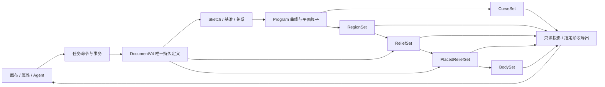

# V4 编辑模型重构任务总控

建档：2026-09-19。状态：**实施中，已接通无界面管线，推进命令与界面装配**。本目录管理分发、依赖、交付和验收；架构事实以[编辑模型方案](../../docs/architecture/editor-model-review-and-refactor-2026-09-19.md)为唯一来源，验收标准以其中第 10 节的 U01–U06、A01–A23 为准。

## 用户校正后的执行边界 · 2026-09-19

- **必须保留现有前端的布局、样式、工具和基本行为。** 本次是数据结构与求值管线重构，不是重做编辑器。此前简化 V4 候选界面的方向不成立，已撤销它的运行入口；其浏览器测试不能作为最终产品验收。
- V4 文档、场景和求值模块从原有 `studio-app.tsx` 工作区背后逐步接入；不得以“新界面功能补齐”为默认切换路径。
- 用户指定的主要验收是内置 `public/sandrone-example.spl` 正常打开和编辑；补充检查 `output/agent-emblem/sandrone-gold-emblem.spl`，私有原件只读、不纳入版本库。保存验证写入测试副本。
- 用户已明确允许本机原生验收，不再要求独立 Windows 账户或 VM；使用专用进程和临时文件，避免把文件转交给用户正在使用的实例。
- 无关旧浏览器用例不再作为完成门槛。必要类型、lint、单元测试及双端构建保留；真实项目的前端行为保持与迁移正确性是最终切换前提。后文原候选界面接线记录仅为历史实施证据，不能覆盖上述边界。

- 代码基线：`180f569`。
- 方案分支：`codex/editor-model-v4-plan`；已提交方案：`6d33795`。
- 启动范围：实现 V4 文档、场景/几何、各阶段求值、统一编辑、现有功能适配、旧工程导入及双端验收。编写本目录不代表已经启用 V4。
- 非目标：通用三维 DCC、任意约束求解器、自由节点编辑器、非均匀场景缩放、共享可写数据块管理；不重写无关平台能力。
- 合同版本：[v1.1](contracts-2026-09-19.md)，持久字段不变；真实 C03 联合链已通过，阶段证据见验收索引。
- 总整合负责人 / 最终验收负责人：主代理。各任务的当前状态与执行者只在所属工作包的检查点中维护。

## 1. 必须守住的产品结果

默认用户只需理解**部件、线条、区域、颜色和厚度**。开始画线就有稳定部件身份，闭合得到可上色区域，首次上色启用对应浮雕贡献，随后可预览、导出；无需手动建立 Source、Fill、体块或制造零件。未上色候选面不在作品树重复列出。

编组仅整理与变换部件。重复纹样、连接边界、引用、打印分层、多零件只在相应业务中展开；展开高级详情不会转换数据、重建程序或改变结果。部件变成空、曲线、多区域、多实体或失效时，身份与编辑入口仍保留。

任何包即使几何测试通过，只要让 U01–U03 必须先配置端口、坐标框架或技术目录，都应返工。复杂性由内部结构和任务命令承接，不向普通流程转嫁。

## 2. 分层合同与代码边界



这张图描述数据依赖，不要求每阶段复制几何，也不要求所有结果都立即计算。场景世界变换、制造依附及关系服务与平面 Program 分责，共用 T06 的组件依赖调度。Worker 只包装同一套纯求值入口。

T00 将下表具体化为可实现的类型、函数签名、错误和示例；本轮已经确定责任与语义，不把下列边界重新留给每个执行者猜测。

| 合同             | 生产者 → 消费者                  | 必须固定的输入输出与不变量                                                                                                               |
| ---------------- | -------------------------------- | ---------------------------------------------------------------------------------------------------------------------------------------- |
| C01 文档与实体   | T02 → 全部                       | 持久 Group/Shape/Sketch/Program 等表、稳定 EntityRef；parentId 与单一 owner 权威；结构非法拒绝，构造失效可保存；无 runtime 网格/文件句柄 |
| C02 源与关系     | T04/T05 → T07、T13、T16          | 精确 cubic、有向边、端点柄；输入自由量及引用，输出求值坐标和可编辑映射；编辑改自由量，屏幕吸附不暗建永久关系                             |
| C03 算子与结果   | T06/T07/T08 → T09、T14、T15、T18 | 显式端口、域、框架、旁路、拓扑身份；ready/empty/无该输出/blocked 有别；Program 只发布曲线与区域；Fill 为 T08 的公共转换实现              |
| C04 场景与重表达 | T03 → T05、T06、T10、T13         | SE(2) pose、世界矩阵、keepWorld；local-result/world-result；重设原点通过注册字段访问器补偿本地数据和入向引用，不靠 UI 扫字段             |
| C05 赋值与制造   | T09/T10/T11 → T13、T15、T17、T18 | RegionSet → ReliefSet → PlacedReliefSet → BodySet；默认/局部覆盖、mm/layers 单一权威、逐区域 Z 和 Part；显示锁定独立于制造               |
| C06 求值与会话   | T06/T12/T14 → UI、API、导出      | 不可变 EvalSnapshot；epoch/revision/previewId/requestId 区分工程、提交和草案；晚到结果不能成为当前结果；不在后台绑定写回文档             |
| C07 命令与视图   | T12/T13/T15 → T16/T17/T20        | expectedRevision、原子事务、范围与稳定实体；任务命令编制真实 Program，输出绑定在事务内完成；编辑器投影只读，可逆派生编辑有明确来源       |
| C08 格式与导入   | T02/T18/T19 → I00、T20           | 纯 V4 codec；legacy → documentV4/idMap/report 单向导入；V4 草稿独立命名空间，首次升级另存；API 版本独立且旧索引必须关联旧快照 revision   |

依赖规则：

- `document/types.ts` 定义持久类型；`construction/types.ts` 定义运行时域及注册接口，禁止两份同名权威 schema。纯模块不导入 React、平台下载或全局编辑状态。
- `scene` 与 `geometry` 处理数据/变更计划，不调用 UI。T03 的重表达访问器与 T06 的依赖收集使用合同注入，不能互相导入造成初始化环。
- `construction` 不导入 legacy importer、UI 或写命令；`relief`、`manufacturing`、`solid` 消费前级合同，不生成旧可编辑 features。
- `editing` 可以调用纯求值准备事务内绑定；求值器不能反向调用 dispatcher。T12 基础事务不依赖具体算子，T13 组合命令依赖已交付的域服务。
- `document/import/` 才允许解释旧 schema/归属规则。旧数学算法可通过适配复用；不能因复用而将旧模型 normalization 变成新运行时入口。
- `editor` 只投影文档与结果，React 发命令；保存/Worker/Agent 不各维护另一份 Document。导出器显式指定阶段和 revision，平台层只处理输出介质。

### 当前实现到新模块的对应关系

| 当前入口                                                                  | 任务及目标职责                         | 退出条件                                          |
| ------------------------------------------------------------------------- | -------------------------------------- | ------------------------------------------------- |
| `project.ts`、`project-format.mjs`、各 schema                             | T02 文档/codec，T18 单向导入，T19 会话 | V4 编辑不再调用旧归属推导                         |
| `source-editor/selection.mjs` 与 node/spline/continuity 算法              | T03 场景，T04/T05 源与关系             | 对象移动不再用 pathIds 代理；源节点靠稳定 ID      |
| `curve-modifiers`、`region-engine`、`partition-engine`、`modifier-engine` | T06–T08 注册表与纯算子                 | 数学可复用，不保留按来源类型猜链的入口            |
| `surface-lineage`、分散 styles、`creation-engine`                         | T08 provenance，T09 赋值/浮雕          | 明确 OutputRef；无多处颜色/厚度权威或后台绑定     |
| `print-stack`、`solid-engine`、`material-solids` 与导出格式               | T10/T11 制造/实体/阶段出口             | 不借旧 features 重建可编辑模型；Part 不等于 Group |
| 根组件 transact、各 command/API                                           | T12/T13/T20                            | 一次事务、一个版本化写入口                        |
| `use-creation-selection`、作品树、源画布                                  | T15–T17                                | 语义选择与任务投影，默认界面不显示技术分层        |
| `model-worker.ts`、持久化、平台装配                                       | T14/T19，I00 接线                      | 同一快照、独立草稿、保留两端构建及原生文件边界    |

## 3. 八个分发包与包内检查点

**分发单位是 8 个 P 工作包，23 个 T 只是包内可签收的检查点。** 不需要为每个 T 开一个独立执行任务；同一负责人连续完成同模块多个 T，减少重复理解背景和接口交接。P00 是持续整合，P01 是独立验证，实际产品实现分成 P02–P07 六个模块。

每个工作包都内含当前工程背景、问题与目标、管线位置、上下游合同、现有代码入口、逐检查点可写范围、交付物和验收记录，可以直接作为分发上下文。完整类型由 T00 的版本化合同补充，不依赖聊天口头约定。

| 分发包                                                                            | 包内检查点         | 建议负责人                           |
| --------------------------------------------------------------------------------- | ------------------ | ------------------------------------ |
| [P00 架构合同、公共整合与默认切换](00-architecture-and-integration-2026-09-19.md) | T00、T22、I00      | 主代理 / 整合负责人                  |
| [P01 基线、验证工具与整体验收](01-validation-2026-09-19.md)                       | T01、T21           | 独立验证负责人                       |
| [P02 文档、旧工程导入与保存恢复](02-document-and-persistence-2026-09-19.md)       | T02、T18、T19      | 文档与持久化负责人                   |
| [P03 场景组织、源几何与编辑关系](03-scene-and-source-geometry-2026-09-19.md)      | T03、T04、T05      | 场景与几何负责人；主代理复核几何语义 |
| [P04 依赖求值、曲线和区域构造](04-evaluation-and-operators-2026-09-19.md)         | T06、T07、T08      | 构造管线负责人；主代理复核 DAG/几何  |
| [P05 外观浮雕、制造放置与导出](05-relief-manufacturing-and-export-2026-09-19.md)  | T09、T10、T11      | 浮雕、制造与实体负责人               |
| [P06 事务、任务命令、Worker 会话与 API](06-editing-runtime-and-api-2026-09-19.md) | T12、T13、T14、T20 | 编辑运行时负责人；主代理复核并发     |
| [P07 编辑器投影、画布与渐进属性](07-editor-experience-2026-09-19.md)              | T15、T16、T17      | 编辑体验负责人                       |

不要求某个 P 全部完成才启动下一个 P：例如 P02 的 T02 签收后即可启动场景/源/事务，P02 的迁移和保存要等管线就绪才回来完成。负责人对模块负责，具体执行者可按就绪情况切换，交接记录上游提交和已完成检查点。

### 检查点依赖

T 的依赖指已签收的具体交付，不是整个 P 包。可以提前只读研究，不可在实现时猜测未冻结的接口。

| 检查点                                                      | 交付边界                           | 前置检查点                                                           |
| ----------------------------------------------------------- | ---------------------------------- | -------------------------------------------------------------------- |
| [T00](00-architecture-and-integration-2026-09-19.md#t00)    | 冻结模块合同与默认体验边界         | 无                                                                   |
| [T01](01-validation-2026-09-19.md#t01)                      | 基线、比较器与隔离浏览器验收入口   | 无                                                                   |
| [T02](02-document-and-persistence-2026-09-19.md#t02)        | V4 文档、验证器与容器编解码        | T00                                                                  |
| [T03](03-scene-and-source-geometry-2026-09-19.md#t03)       | 场景身份、编组与坐标变换           | T02                                                                  |
| [T04](03-scene-and-source-geometry-2026-09-19.md#t04)       | 稳定 Sketch 拓扑与源编辑算法       | T02                                                                  |
| [T05](03-scene-and-source-geometry-2026-09-19.md#t05)       | 基准、有限关系与编辑自由量         | T03、T04                                                             |
| [T06](04-evaluation-and-operators-2026-09-19.md#t06)        | 有类型 Program、依赖调度与结果快照 | T02、T03                                                             |
| [T07](04-evaluation-and-operators-2026-09-19.md#t07)        | 曲线来源、重复与连接算子           | T04、T05、T06                                                        |
| [T08](04-evaluation-and-operators-2026-09-19.md#t08)        | 区域算子、输出身份与局部作用域     | T04、T06                                                             |
| [T09](05-relief-manufacturing-and-export-2026-09-19.md#t09) | 外观与浮雕赋值解析                 | T02、T08                                                             |
| [T10](05-relief-manufacturing-and-export-2026-09-19.md#t10) | 层数、依附、放置与制造映射         | T03、T09                                                             |
| [T11](05-relief-manufacturing-and-export-2026-09-19.md#t11) | 实体内核适配与分阶段导出           | T07、T08、T10 及 C03 联合签收                                        |
| [T12](06-editing-runtime-and-api-2026-09-19.md#t12)         | 统一事务、草案与撤销历史           | T02                                                                  |
| [T13](06-editing-runtime-and-api-2026-09-19.md#t13)         | 任务命令与基础构造自动编制         | 基础：T03、T04、T07、T08、T09、T12 及 C03 联合签收；制造签收另需 T10 |
| [T14](06-editing-runtime-and-api-2026-09-19.md#t14)         | Worker 协议与会话求值协调          | T06、T12                                                             |
| [T15](07-editor-experience-2026-09-19.md#t15)               | 编辑器投影、拾取与语义选择         | T03、T06、T09、T12                                                   |
| [T16](07-editor-experience-2026-09-19.md#t16)               | 默认画布与直接编辑接入             | T01、T04、T13 基础签收、T14、T15                                     |
| [T17](07-editor-experience-2026-09-19.md#t17)               | 作品树、区域属性与按需构造详情     | T01、T05、T13 基础签收、T15；分层属性验收另需 T13 制造签收           |
| [T18](02-document-and-persistence-2026-09-19.md#t18)        | 旧工程单向导入与全链对照           | T01、T02、T07、T08、T09、T10、T11                                    |
| [T19](02-document-and-persistence-2026-09-19.md#t19)        | 打开、保存、恢复与平台边界接入     | T02、T12、T14、T18                                                   |
| [T20](06-editing-runtime-and-api-2026-09-19.md#t20)         | Agent API、兼容投影与能力发现      | T11、T13、T14、T15、T18                                              |
| [T21](01-validation-2026-09-19.md#t21)                      | 完整用户旅程、迁移与双端验收       | T01、T11、T16、T17、T18、T19、T20                                    |
| [T22](00-architecture-and-integration-2026-09-19.md#t22)    | 默认切换、旧写入退役与当前文档更新 | T21                                                                  |

### 四个并发名额下的优先分发

下面按“主代理 + 最多 3 名执行者”规划。采用依赖就绪即启动的调度，不设不必要的整批等待；同列 A/B/C 表示执行名额，人员可以保持或交接。没有实测耗时，不能承诺绝对最短日历工期；这是当前依赖下优先缩短关键路径的方案。

| 就绪事件                | 主代理 / P00                                 | 名额 A                        | 名额 B                             | 名额 C                                   |
| ----------------------- | -------------------------------------------- | ----------------------------- | ---------------------------------- | ---------------------------------------- |
| 开始准备                | T00：合同、默认故事板                        | P01/T01：基线与 runner        | 暂不启动实现                       | 暂不启动实现                             |
| G0a：T00 签收           | 为 T01 登记 runner 接口及依赖/锁文件唯一写者 | P02/T02：文档/codec           | P01/T01 可继续，不阻塞纯模型       | 只读准备场景/源/事务，不为占满名额开任务 |
| T02 签收                | P03/T03：场景与变换                          | P03/T04：Sketch               | P06/T12：事务                      | 按需复核基线，不阻塞核心                 |
| T03/T04 签收            | P03/T05：关系/编辑自由量                     | P04/T06：调度与 snapshot      | T12 收尾；T06 就绪后 T14           | 按需测试审阅                             |
| T06 就绪，T05 随后就绪  | 复核 DAG/关系并接线                          | P04/T07：曲线算子（须等 T05） | P04/T08：区域/Fill/provenance      | P06/T14：Worker 会话                     |
| T08 签收                | 接通各域，审查默认命令合同                   | P05/T09 → T10：浮雕/放置      | T09 后 P07/T15：投影               | T07/T14 收尾；空闲名额接审阅             |
| T09 和 C03 联合签收就绪 | G1 逐域装配                                  | P05/T10，完成后 T11           | P06/T13 基础命令；T10 后补制造签收 | P07/T15 投影；就绪即接 UI                |
| T13 基础、T14、T15 签收 | 隔离 UI 接线，完成实体后通过 G2              | P07/T16：画布                 | P07/T17：树/属性                   | T11 未完成先完成导出；就绪后 P02/T18     |
| T18 签收                | G3 公共保存/API 接线                         | P02/T19：保存恢复             | P06/T20：Agent/API                 | P01 准备完整验收、复核已完成旅程         |
| 全部 G3 交付            | 审核公共边界与退役清单                       | P01/T21：独立验收             | 必要缺陷修复，按文件分配           | 必要格式/原生验收协作                    |
| G4 通过                 | T22：默认切换、退役与 G5                     | P01 在最终提交复验            | 按需修复                           | 按需修复                                 |

几个决定并行效率的边界：

- **T03 / T04 / T12 分开**：场景、源几何、事务各写独立模块，文档合同确定后可同时开始；复杂坐标/关系判断仍由主代理处理。
- **T07 / T08 并行**：曲线算子交付 CurveSet，Fill 的实现只属于 T08。T08 用符合 C03 的真实曲线 fixture 独立运算，不需要等镜像/阵列的所有编辑功能；两者完成后由 P04/P00 做 [C03 联合签收](04-evaluation-and-operators-2026-09-19.md#c03-interop)，T11/T13 的真实链交付必须等该签收。
- **T11 / T13 / T15 并行**：T13 基础绘制/赋值不等待 T10 制造解析，先供 T16/T17 接入；同检查点的制造命令再等 T10 补签。T14 只签协议与会话核心，实际平面/实体 Worker 接通由 I00 随 T08/T11 完成并在 G1/G2 验证，不能提前声称 A16 已通过。
- **T16 / T17 / T18 并行**：画布、属性和迁移写入范围不重叠。G2 的用户主路径可以先通过，不必等所有历史工程转换。
- **T19 / T20 并行**：文件会话和 API 协议分模块，最终根组件接线由 P00 串行处理。
- 同一待验收提交上的 `check:all` 结果可供多个检查点引用；各自最小测试仍须完成。共享工作区不同时运行会清理相同输出的生产构建，由 P00 或 P01 串行执行并记录。

P00 只保留必要接线和架构复核，不能让每个纯 helper 的实现都等待主代理代写。包内临时协作者必须有确切子目录范围；不把“同属 P04/P07”理解为可以同时修改同一文件。

### 阶段门槛

证据记录在[验收索引](acceptance-2026-09-19.md)，不能以“目录齐全”替代。

| 门槛          | 必需交付                                                                             | 可以证明什么                                                                             | 允许的使用范围                           |
| ------------- | ------------------------------------------------------------------------------------ | ---------------------------------------------------------------------------------------- | ---------------------------------------- |
| G0a 合同      | T00，P00 登记版本                                                                    | 数据例子/默认步骤可实现，模块合同固定                                                    | T02 及后续依赖就绪的纯模块可开始         |
| G0b 基线/工具 | T01，P00 登记 runner 与阈值                                                          | 旧行为有复现，测试真实可运行                                                             | 浏览器、迁移和全量验收；不反向阻塞纯模块 |
| G1 无界面全链 | G0a/G0b、T02–T14（含 T13 制造签收）、C03 联合签收与 I00 实际 Worker 接通，T15 可并行 | 同一 Document 经命令生成曲线/区域/浮雕/放置/实体；源和实体导出分工明确；F01/F02 反例消除 | 隔离 fixtures 和开发入口                 |
| G2 默认体验   | G1、T15–T17、P00 真实接线                                                            | U01/U02 基础流程、U03 整理与真实手势，不要求技术配置                                     | 隔离 V4 编辑器，可导出测试产物           |
| G3 全功能试验 | G2、T18–T20、P00 保存/API 装配                                                       | 旧工程、API、保存恢复和实体链一致；一个可写模型                                          | 隔离试运行和完整迁移清单                 |
| G4 候选验收   | T21，全部 U/A 与必需检查                                                             | 双端前端及隔离原生文件流程通过；性能/精度/失败状态有证据                                 | 允许 T22 默认切换                        |
| G5 最终签收   | T22、P00，最终提交复验                                                               | 默认即 V4，旧写路径退役，指南和 API 与实际一致                                           | 重构完成                                 |

G1 内的检查点逐项先签收，已完成模块随即接线形成早期切片；未实现的域显式 unavailable，不能靠占位结果提前通过完整 G1。开发开关只用于隔离验证，不增加用户可见“V4/DCC 模式”。日常默认保持完整旧编辑器直到 G4；一个会话只用一种文档模型。

## 4. 公共文件、整合与退役

I00 独占共享根组件、旧工作区入口、Worker 入口、现有公共内核签名、`package.json`/`pnpm-lock.yaml`、构建和平台配置的装配改动。任务负责人提供新增模块、props/服务接口、最小接线补丁说明与验证；I00 不等所有任务结束才集中接线。

如必须让某任务修改共享文件，由 I00 先在自己的登记表中写明文件、执行者和时段，在该范围暂停其他写入；完成后立即审阅整合。不得长期并行改 `studio-app.tsx` 或 `creation-workspace.tsx`。具体签收方式见[任务管理约定](../README.md)。

退役分两步：试验期允许旧引擎作为离线对照及旧默认入口；G4 后移除旧 GUI/API 写入口、读时推导、后台绑定和新结果再编译旧模型的回路。保留项必须列明用途：

- legacy schema 解释只能在受控导入边界；对照工具只能在测试/验证路径。
- 贝塞尔、JSTS、Manifold、3MF/Bambu 格式数学与序列化能力可复用，不因文件名旧就机械删除。
- 兼容静态路径、Worker/wasm 特殊加载、Web/Tauri 共享入口继续遵守仓库指南。
- 旧源文件和 migration report 保留。代码回退靠关闭试运行入口或回到已验证提交，不能把 V4 文件无损降成 V3；回退后保留 V4 原件，不交给旧 writer。

## 5. 验证基础与验收材料

### 当前已有命令

```sh
pnpm test:core
pnpm test:export
pnpm check:all
pnpm desktop:release
git diff --check
```

`pnpm test` 当前枚举 `scripts/tests/unit/test-*.mjs`；每个新单测放在该目录后会纳入全量运行。`check:all` 覆盖类型、lint、Node 单测、格式、Rust 格式/编译和双端前端构建，**不含浏览器旅程或原生桌面交互**。

### T01 必须新增的入口

`pnpm test:browser` 和卡片中的 `test-v4-*.mjs` 当前尚不存在。以下是实施合同，不能在报告中写成已运行：

```sh
pnpm test:browser --suite legacy --target web
pnpm test:browser --suite v4 --case basic-authoring --target web
pnpm test:browser --suite v4 --target web
pnpm test:browser --suite v4 --target desktop-frontend
```

T01 清点已有 browser modules、适配不同函数签名；具体参数/服务/产物合同见 [P01 runner 协议](01-validation-2026-09-19.md#runner-contract)。经 I00 锁定 Playwright 依赖并记录浏览器二进制安装命令。runner 启动自己的 localhost 严格端口和浏览器，每例新的 context/测试工程/文件替身，处理超时、异常退出与清理。不得连接用户页面、CDP、端口或已绑定文件。

`--target web` 使用 Web 生产构建并自管其服务；`desktop-frontend` 服务桌面前端生产产物并验证共用界面，不声称覆盖 Tauri IPC。需要开发服务器的快速调试应与正式产物验收明确区分。单例不存在、断言失败、超时、服务占用或未支持的 target 均非零退出；预期失败复现有独立断言，不能把被跳过的失败测试计为通过。

### 基线与 fixture 清单

T01 在改迁移前固定 manifest、比较器和阈值；T18 只增加明确缺失的覆盖，不为迁移结果反向放宽已有阈值。

| 最小数据 / 当前参考                            | 验证重点                                          | 对应任务                |
| ---------------------------------------------- | ------------------------------------------------- | ----------------------- |
| 无底图空工程、开放线、闭合杯身                 | 同一身份、空与失败有别、默认上色/厚度/导出        | T02、T04、T07、T09、T16 |
| `live-surfaces.mjs`、`surface-lineage.json`    | 多 source、失效恢复、拓扑身份/赋值                | T08、T09、T18           |
| `hair-partition.json`、`shoulder-region.json`  | 分区、孔、属性范围、精确局部目标                  | T08、T13、T15–T18       |
| `sandrone-example.spl`、`draw-cup-emblem.mjs`  | 开放 1/8、镜像/阵列/Join/Fill、母线编辑、成品保留 | T05、T07、T11、T16–T18  |
| 拟新增：多 Part、多底面、selected 切削、层依附 | 逐区域 Z/层数/材料体积，不把组当制造零件          | T10、T11、T18           |
| 拟新增：共享基准、两种引用、换父级/重设原点    | 对象组织、局部框架与消费者世界结果                | T03、T05、T06、T21      |
| 拟新增：V1/V2/V3、失败旧工程、损坏/多资源包    | 单向转换、完整报告、无自动覆盖、确定性往返        | T02、T18、T19           |
| 拟新增：乱序 Worker、迟到恢复、保存时继续编辑  | revision/epoch、历史、文件与草稿边界              | T12、T14、T19、T20      |

所有 fixture 使用已提交的最小可复现内容，不能依赖本机私有工程。成功旧文件比较世界 cubic、差集面积/边界距离、环孔/连通、颜色/厚度/Z/层、材料与实体；失败旧文件比较源数据、引用、可修复诊断。旧移动测试只证明旧 path 位移，不能证明 V4 pose。

数值阈值按既有内核精度和单位在 T01 固定，记录计算方法与基线；性能记录指定环境、fixture、冷/热结果及拖动到可见结果延迟，按 T00/T01 评审的预算验收。需要调整预算或容差，必须说明原因和受影响项，重新评审基线，不允许迁移实现者自行改成通过。

### 证据要求

每项记录待验收提交 hash、合同版本、fixture/hash、实际命令、退出码/断言、运行环境、U/A 编号与结论。截图辅助说明界面，不代替几何/文档/实体断言。

运行产物放 `outputs/v4-qa/<run-id>/`（已在仓库忽略规则内），小型 manifest/fixture 纳入版本控制；正式签收摘要放 `docs/qa/editor-model-v4-acceptance-<实际日期>.md`，并从本目录验收索引链接。未运行、无证据、阻塞分别明确记录，不写 PASS。

T21/T22 的原生验收在独立 Windows 测试账户或 VM 进行：免安装程序启动、打开临时 .spl、保存与重开、第二实例转交路径、失败写入反馈。不得因单实例机制把测试工程发送到用户的正在运行实例。`bundle.active=false`，不生成安装包或注册关联。

## 6. 分发、状态与合同变更

当前优先分发 P00 的 T00/I00 与 P01 的 T01；其余按上述就绪表推进。状态流程为“未开始 → 执行中 → 待验收 → 完成”，失败回“返工”，外部前提缺失记“阻塞”并列条件。写完代码或自测绿不能代替验收者签收。

分发消息模板：

```text
执行工作包：<P 编号与文档路径>；本轮检查点：<T 编号>
起始提交 / 合同版本：<hash / 版本>
执行者 / 验收者：<姓名或任务>
先读：AGENTS.md、总控、该子文档、其前置交付
可写：<确切文件或模块目录；包括本任务测试>
只读/禁止：共享入口由 I00 管理；不得修改其他执行者文件
交付：<本任务交付物、提交、接线说明>
验证：<最小检查、必需 U/A、check:all、浏览器/原生范围>
完成后：填写任务记录并置“待验收”；不得自行豁免失败项
```

任务执行者遇到合同含混，提交具体输入、预期输出、备选语义和受影响消费者；I00/架构负责人在 T00 合同追加版本及迁移说明，更新受影响任务的依赖/范围/测试后继续。已经完成的消费者若受破坏必须重新验收，不能只改类型使编译通过。

新增算子通过 A23 验证：在测试注册一个小型曲线或区域算子，再增加一种结果消费适配；无需改来源分类、Document 权威或默认树目录。这个用例用于证明扩展边界，不据此增加用户默认功能。

## 7. 完成定义

详细映射和待填写结果见[验收索引](acceptance-2026-09-19.md)。8 个工作包内的 T00–T22 与 I00 签收、G5 通过、全部 U/A 在最终切换提交有证据、当前指南与实际一致，才算完成本次重构。任何保留的失败或不支持能力必须回到方案范围决策，不能隐藏在“后续优化”中越过门槛。

## V4 候选接线历史记录（2026-09-19，入口已撤销）

以下仅记录此前候选模块的实现，不是当前运行入口。原候选页面曾通过 `?editor=v4` 使用 `window.traceStudioV4.call(action,args)` 暴露 API 5.0；该 URL 现已恢复原工作区。V4 写操作统一要求 `expectedRevision`，求值/导出要求明确的 epoch/revision；后续需在保持原 UI 的前提下完成接线与验收。

普通绘制、闭合、上色、毫米厚度、移动、分区和挖孔共用任务命令，内部算子不成为默认必填项。制造层/Part 编辑、完整源节点/派生柄交互、重复/引用任务界面、原生文件事件和既有快捷键完整适配仍待本任务验收，不能将当前候选称为默认替换版本。
